# Paper Trading App — Context & System Reference

> Local-first paper trading and portfolio tracking for **Indian equities** (NSE/BSE), index funds, and commodities.  
> This document describes architecture, data flow, database schema, API surface, services, and frontend pages.

---

## Table of contents

1. [Overview](#1-overview)
2. [Tech stack](#2-tech-stack)
3. [System architecture](#3-system-architecture)
4. [Application & data flow](#4-application--data-flow)
5. [Database schema](#5-database-schema)
6. [REST API reference](#6-rest-api-reference)
7. [Backend services & functions](#7-backend-services--functions)
8. [Trading strategies](#8-trading-strategies) — [§8.1 Strategy engine](#81-strategy-engine-overhaul-recent), [§8.2 Trading firm standards](#82-trading-firm-standards-recent), [§8.3 AI Think Tank](#83-ai-think-tank-ollama)
9. [Frontend pages](#9-frontend-pages)
10. [CLI scripts](#10-cli-scripts)
11. [Configuration & deployment](#11-configuration--deployment)
12. [Current data snapshot](#12-current-data-snapshot)
13. [Business logic & domain rules](#13-business-logic--domain-rules)
14. [User feature guide — how to use the app](#14-user-feature-guide--how-to-use-the-app)

---

## 1. Overview

| Aspect | Detail |
|--------|--------|
| **Purpose** | Paper trading, portfolio tracking, market exploration, strategy signals, backtesting |
| **Markets** | NSE, BSE stocks; index funds/commodities via Yahoo Finance |
| **Price source** | Yahoo Finance (`yfinance`) — daily OHLCV only (`1d` timeframe) |
| **Users** | JWT auth; server-side sessions; optional debug auth bypass for local dev |
| **Disclaimer** | Educational tool only — not financial advice |

**Main capabilities**

- Register/login, multiple portfolios (manual + paper)
- Ingest ~6,780 Indian tickers; store daily candles from 2010+
- Explore: movers, all-stocks screener, sequential rankings, manual sync
- Paper orders: MARKET immediate; LIMIT/STOP matched on daily OHLCV after sync (or manual match)
- 18 strategy templates (RSI, SMA, MACD, sector rotation, VWAP, Kalman, etc.) + backtests with optional walk-forward validation
- ATR-based dynamic stops, signal outcome tracking, and strategy accuracy API
- Indian delivery charges (STT, brokerage, GST, stamp duty), slippage model, risk dashboard (beta/VaR/concentration/drawdown)
- Rate-limited auth, password reset API, optional email signal alerts
- Data ingestion dashboard (coverage, sync history, latest price date)
- Index funds, market trends treemap, NIFTY/Sensex membership data
- **AI Think Tank** (page 10): local Ollama LLM — signal synthesis, backtest interpretation, pre-trade reasoning, natural-language screener, portfolio narrative, journal analysis, activity audit logs

---

## 2. Tech stack

| Layer | Technology |
|-------|------------|
| **Backend** | Python 3.12, FastAPI, Uvicorn |
| **Frontend** | Streamlit 1.41 (multipage) |
| **Database** | PostgreSQL 16 |
| **ORM** | SQLAlchemy 2.x |
| **Migrations** | Alembic (18 revisions) |
| **Auth** | JWT (HS256) + bcrypt + `auth_sessions` |
| **Market data** | yfinance, pandas |
| **Charts** | Plotly |
| **Containers** | Docker Compose (postgres + backend + frontend) |

**Project layout**

```
paper_trading_app/
├── backend/app/          # FastAPI application
│   ├── main.py           # App entry, routers, middleware
│   ├── models/           # SQLAlchemy tables
│   ├── schemas/          # Pydantic request/response models
│   ├── routers/          # HTTP endpoints
│   ├── services/         # Business logic
│   └── strategies/       # Signal generation algorithms
├── frontend/             # Streamlit UI
│   ├── streamlit_app.py  # Home (login/register)
│   └── pages/            # Sidebar pages 1–8
├── scripts/              # CLI: ingest, sync, seed, run
├── data/                 # Sample ticker CSVs
├── docker-compose.yml
├── run.ps1 / run.bat
└── context.md            # This file
```

---

## 3. System architecture

### 3.1 High-level diagram

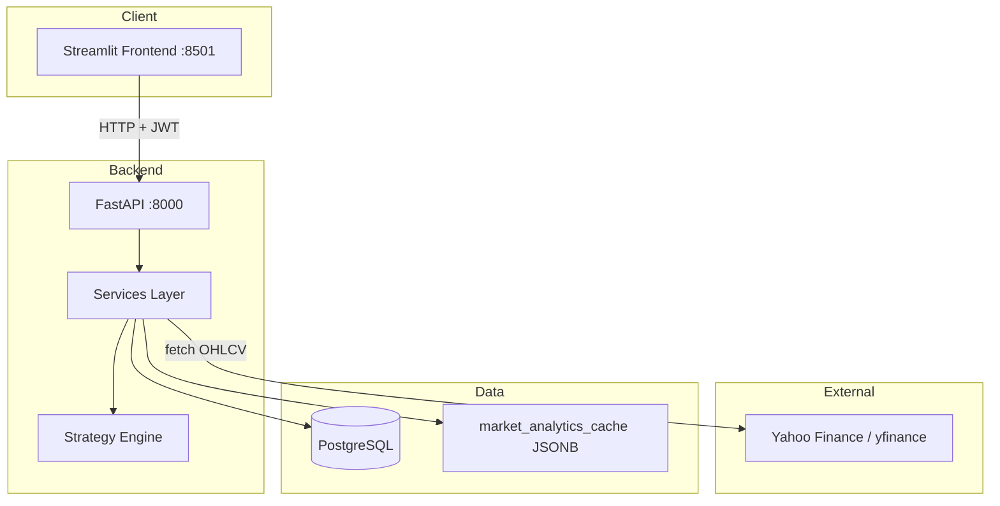

### 3.2 Docker services

| Service | Port | Role |
|---------|------|------|
| `postgres` | 5432 | PostgreSQL 16, volume `postgres_data` |
| `backend` | 8000 | Alembic migrate → Uvicorn |
| `frontend` | 8501 | Streamlit → calls `http://backend:8000` |

### 3.3 Layering rules

- **Routers** — HTTP validation, auth, call services, return schemas
- **Services** — business logic, DB access, yfinance calls
- **Models** — SQLAlchemy table definitions
- **Schemas** — Pydantic DTOs (no DB logic)
- **Frontend** — HTTP only via `api_client.py`; no direct DB access

---

## 4. Application & data flow

### 4.1 User registration flow

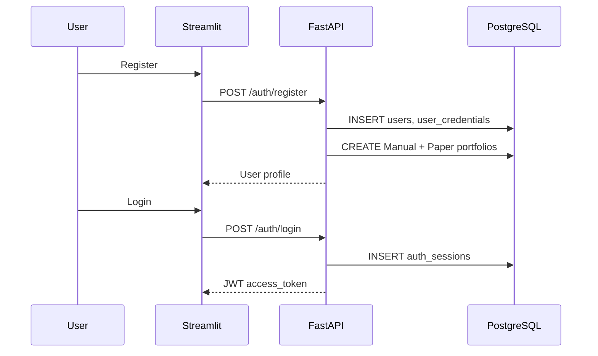

### 4.2 Market data ingestion flow

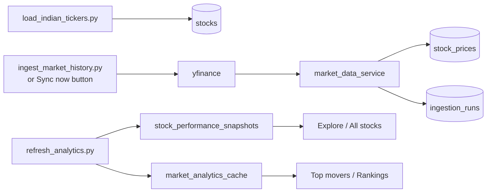

**Ingestion modes**

| Mode | When | Behavior |
|------|------|----------|
| **FULL** | Initial backfill | Fetch from `start_date` (e.g. 2010) through T-1 |
| **INCREMENTAL** | Daily sync / Sync now | Skip if already current; fetch `last_date + 1` → T-1 |
| **Parallel** | `ingest_market_history.py` | Batch Yahoo download (200 symbols), 32 workers |

**Sync controls (Explore page)**

- **Sync now** — manual only; no auto-sync on page load
- **Session scheduler** — optional interval (15m–4h) while tab is open
- Background job: `POST /market/sync` → `sync_all_active_stocks(incremental=True)` → `refresh_all_analytics()`

### 4.3 Paper trading flow

**MARKET** — immediate fill on latest close (+ slippage + Indian charges).

**LIMIT / STOP_LOSS** — `PENDING` with 30-day `expires_at`; filled when `match_pending_orders` runs after price sync (or `POST /paper-orders/match`).

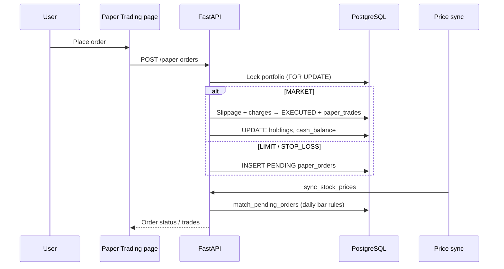

### 4.4 Portfolio valuation flow

1. Load `portfolio_holdings` for portfolio
2. Batch-fetch latest closes from `stock_prices` (`get_latest_prices_map`)
3. Compute: invested, market value, unrealized/realized PnL, total value
4. Optional: upsert `portfolio_daily_snapshot` for chart history

### 4.5 Market overview fallback chain

`get_market_overview()` tries in order:

1. **yfinance** — live index quotes (^NSEI, ^BSESN, etc.)
2. **database** — stored prices + cached movers from `market_analytics_cache`
3. **sample_fallback** — hardcoded sample rows (UI layout only)

Movers (top gainers/losers/volume) prefer **full-universe DB computation** from T-1 daily candles (`market_movers_service`).

> **Detailed rules:** See [Section 13 — Business logic & domain rules](#13-business-logic--domain-rules) for formulas, validation, and design decisions.

---

## 5. Database schema

### 5.1 Entity relationship (core)

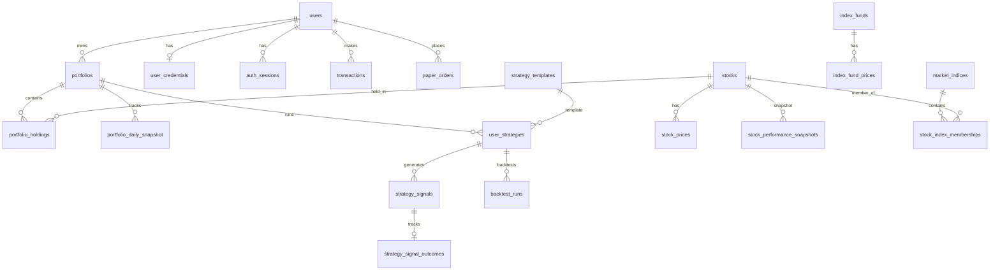

### 5.2 Tables reference

#### Auth & users

| Table | Purpose | Key columns |
|-------|---------|-------------|
| `users` | Profile & paper cash | `id`, `name`, `user_name` (unique), `email`, `starting_cash`, `current_cash`, `risk_profile`, `email_alerts_enabled` |
| `user_credentials` | Password hashes only | `user_id` (FK, unique), `password_hash` |
| `auth_sessions` | Server-side JWT sessions | `token_jti_hash` (unique), `expires_at`, `revoked_at` |
| `password_reset_tokens` | Password reset tokens | `token_hash`, `expires_at`, `used_at` |

#### Market data — stocks

| Table | Purpose | Key columns |
|-------|---------|-------------|
| `stocks` | Ticker master | `symbol`+`exchange` (unique), `yahoo_symbol` (unique), `sector`, `industry`, `is_active`, `is_delisted` |
| `stock_prices` | Daily OHLCV | `stock_id`, `price_datetime`, `timeframe`='1d', OHLCV, `volume`; unique `(stock_id, price_datetime, timeframe)` |
| `ingestion_runs` | Sync job audit | `status`, `ingestion_mode`, `total_symbols`, `success_count`, `failed_count`, `rows_saved`, `started_at`, `finished_at` |
| `stock_performance_snapshots` | Precomputed performance | `stock_id` (PK), latest price/volume, `price_1m/3m/6m/1y`, `change_*_pct`, `refreshed_at` |
| `market_analytics_cache` | JSONB cache | `cache_key` (PK), `payload`, `refreshed_at` — movers, sequential rankings, **`llm:*`** LLM responses |
| `search_query_logs` | Search telemetry | `search_type`, `query_text`, `duration_ms`, `status` |
| `ai_action_logs` | AI Think Tank audit | `action_type`, `model_name`, `ollama_connected`, `request_payload`, `response_payload`, `llm_prompt`, `llm_response`, `cache_hit`, `status`, `duration_ms` |

#### Market data — indices & funds

| Table | Purpose | Key columns |
|-------|---------|-------------|
| `market_indices` | Index definitions (NIFTY 50, etc.) | `index_code`, `yahoo_symbol`, `exchange` |
| `stock_index_memberships` | Constituent mapping | `index_id`, `stock_id`, `weight`, `effective_date`; unique `(index_id, stock_id)` |
| `index_funds` | Index/commodity instruments | `symbol`, `yahoo_symbol`, `category`, `latest_price` |
| `index_fund_prices` | Daily OHLCV for funds | Same shape as `stock_prices` |

#### Portfolios & trading

| Table | Purpose | Key columns |
|-------|---------|-------------|
| `portfolios` | User portfolios | `portfolio_type` (manual/paper), `starting_value`, `cash_balance` |
| `portfolio_holdings` | Open positions | `quantity`, `average_buy_price`, `total_invested`, `realized_pnl`; unique `(portfolio_id, stock_id)` |
| `portfolio_daily_snapshot` | Daily NAV history | `snapshot_date`, `total_value`, `total_return_pct`, etc. |
| `transactions` | Manual buys/sells | `transaction_type`, `quantity`, `price`, `charges`, `net_amount` |
| `paper_orders` | Simulated orders | `order_type`, `side`, `status`, `limit_price`, `stop_price`, `expires_at`, `matched_at`, `matched_price`, `notes` |
| `paper_trades` | Executed paper fills | `executed_price`, `quoted_price`, `slippage_bps`, `slippage_cost`, `charges`, `charges_breakdown` (JSONB) |

#### Strategies & backtests

| Table | Purpose | Key columns |
|-------|---------|-------------|
| `strategy_templates` | Built-in strategies | `strategy_name`, `strategy_type` (unique), `default_parameters` (JSONB) |
| `user_strategies` | User configs | `parameters`, `risk_settings`, `portfolio_id`, `is_enabled` |
| `strategy_signals` | Generated signals | `signal_type`, `confidence_score`, `suggested_quantity`, `indicators` (JSONB) — includes ATR stop fields on BUY/SELL |
| `strategy_signal_outcomes` | Signal forward-test stubs | `signal_id` (unique), `signal_date`, `signal_price`, `price_5d/10d/20d`, `return_*_pct`, `profitable_*`, `stop_hit`, `outcome_evaluated_at` |
| `backtest_runs` | Simulation results | `initial_capital`, `final_value`, `total_return_pct`, `max_drawdown_pct`, `sharpe_ratio`, optional walk-forward: `walk_forward_enabled`, `is_sharpe_ratio`, `oos_*`, `overfitting_score` |
| `backtest_trades` | Simulated trades | `side`, `quantity`, `price`, `trade_date`, `pnl` |

### 5.3 Alembic migration chain

| Revision | Adds |
|----------|------|
| `0001_initial_schema` | Core users, stocks, prices, portfolios, trading, strategies, backtests |
| `0002_split_auth_credentials` | `user_credentials`, `auth_sessions`, `password_reset_tokens` |
| `0003_name_username` | `users.name`, unique `user_name` |
| `0004_ingestion_runs` | Ingestion audit table |
| `0005_ingestion_rows_saved` | Rename `rows_inserted` → `rows_saved` |
| `0006_ingestion_batch_bounds` | `batch_offset`, `batch_limit` |
| `0007_ingestion_run_strategy` | `ingestion_mode`, `chunk_days`, `sleep_seconds` |
| `0008_portfolio_analytics` | `cash_balance`, snapshots, analytics cache, price index |
| `0009_index_funds` | Index funds + prices; backtest `index_fund_id` |
| `0010_market_index_memberships` | NIFTY/Sensex membership tables |
| `0011_stock_delisted_flags` | `is_delisted`, `delisted_reason`, `delisted_detected_at` |
| `0012_search_query_logs` | Search telemetry (`search_type`, `query_text`, `duration_ms`, …) |
| `0013_strategy_signal_outcomes` | `strategy_signal_outcomes` table; unique `strategy_templates.strategy_type` |
| `0014_backtest_walk_forward` | Walk-forward columns on `backtest_runs` |
| `0015_limit_order_matching` | `paper_orders`: `expires_at`, `matched_at`, `matched_price`; status `EXPIRED` |
| `0016_slippage_charges` | `paper_trades`: `quoted_price`, `slippage_bps`, `slippage_cost`, `charges_breakdown` |
| `0017_notes_field` | `paper_orders.notes` |
| `0018_email_alerts` | `users.email_alerts_enabled` |
| `0019_ai_action_logs` | `ai_action_logs` — AI/Ollama request audit trail |

---

## 6. REST API reference

Base URL: `http://localhost:8000`  
Auth: `Authorization: Bearer <token>` (except where noted)

### Health

| Method | Path | Description |
|--------|------|-------------|
| GET | `/health` | Health check |

### Auth (`/auth`)

| Method | Path | Auth | Description |
|--------|------|------|-------------|
| POST | `/auth/register` | No | Create user + default portfolios (rate limit 5/min per IP) |
| POST | `/auth/login` | No | Issue JWT + session (rate limit 10/min per IP) |
| POST | `/auth/forgot-password` | No | Request reset email (always 200; 3/min per IP) |
| POST | `/auth/reset-password` | No | Set new password from token; revokes sessions |
| GET | `/auth/me` | Yes | Current user profile |
| GET | `/auth/debug-status` | No | Debug bypass flag |
| POST | `/auth/logout` | Yes | Revoke session |

### Data (`/data`)

| Method | Path | Description |
|--------|------|-------------|
| GET | `/data/ingestion-dashboard` | Coverage, sync stats, recent runs |

### Market (`/market`)

| Method | Path | Description |
|--------|------|-------------|
| GET | `/market/overview` | Indices + movers + volume leaders |
| POST | `/market/refresh-analytics` | Refresh snapshots + caches |
| GET | `/market/sync-status` | Last sync time, running job |
| POST | `/market/sync` | Start background incremental sync |
| GET | `/market/sequential-rankings` | Top buy/sell candidates |
| GET | `/market/trends/filters` | Trend filter options |
| GET | `/market/trends` | Period-based market trends |

### Stocks (`/stocks`)

| Method | Path | Description |
|--------|------|-------------|
| GET | `/stocks/search` | Search by symbol/name |
| GET | `/stocks/sectors` | Distinct sectors |
| GET | `/stocks/industries` | Distinct industries |
| GET | `/stocks/performance` | Performance table (filters, sort) |
| GET | `/stocks/{id}` | Single stock metadata |
| GET | `/stocks/{id}/prices` | OHLCV history |
| GET | `/stocks/{id}/algo-findings` | Multi-algo analysis |
| POST | `/stocks/{id}/sync-prices` | Sync one stock from Yahoo |
| POST | `/stocks/sync-all` | Bulk sync (API cap: 25 symbols) |

### Index funds (`/index-funds`)

| Method | Path | Description |
|--------|------|-------------|
| GET | `/index-funds/search` | Search index/commodity funds |
| GET | `/index-funds/performance` | Performance table |
| GET | `/index-funds/returns` | Return time series |
| GET | `/index-funds/{id}` | Single fund metadata |
| GET | `/index-funds/{id}/prices` | OHLCV history |
| GET | `/index-funds/{id}/algo-findings` | Algo findings |
| POST | `/index-funds/{id}/sync-prices` | Sync one fund |
| POST | `/index-funds/sync-all` | Bulk sync (cap: 25) |

### Portfolios (`/portfolios`)

| Method | Path | Description |
|--------|------|-------------|
| POST | `/portfolios` | Create portfolio |
| GET | `/portfolios` | List user portfolios |
| GET | `/portfolios/{id}` | Get portfolio |
| GET | `/portfolios/{id}/holdings` | Holdings with stock data |
| GET | `/portfolios/{id}/performance` | Valuation + 365-day snapshots |
| GET | `/portfolios/{id}/risk-metrics` | Beta vs NIFTY 50, VaR, concentration (HHI), max drawdown vs benchmark |

### Transactions (`/transactions`)

| Method | Path | Description |
|--------|------|-------------|
| POST | `/transactions/manual-buy` | Record manual buy |
| POST | `/transactions/manual-sell` | Record manual sell |
| GET | `/transactions` | List transactions |

### Paper trading

| Method | Path | Description |
|--------|------|-------------|
| POST | `/paper-orders` | Place order; optional `notes`, `slippage_bps` override |
| POST | `/paper-orders/match` | Manually run LIMIT/STOP matcher (all or `stock_id`) |
| GET | `/paper-orders` | List orders |
| POST | `/paper-orders/{id}/cancel` | Cancel pending order |
| GET | `/paper-trades` | List executed trades (includes slippage/charges breakdown) |

### Strategies (`/strategies`)

| Method | Path | Auth | Description |
|--------|------|------|-------------|
| GET | `/strategies/templates` | No | List strategy templates |
| POST | `/strategies/user-strategy` | Yes | Create user strategy |
| GET | `/strategies/user-strategy` | Yes | List user strategies |
| POST | `/strategies/generate-signal` | Yes | Run strategy, persist signal |
| POST | `/strategies/preview-signal` | Yes | Dry-run without saving |
| GET | `/strategies/signals` | Yes | Signal history |
| GET | `/strategies/signal-accuracy` | No | Win rates / avg returns by strategy (`lookback_days`, optional `strategy_template_id`) |
| POST | `/strategies/signals/{id}/execute-paper-order` | Yes | Signal → paper order |

### Backtest (`/backtest`)

| Method | Path | Description |
|--------|------|-------------|
| POST | `/backtest/run` | Run simulation; optional `walk_forward: true` for 70/30 IS/OOS split |
| GET | `/backtest/{id}` | Get run metrics |
| GET | `/backtest/{id}/trades` | List simulated trades |

### AI Think Tank (`/ai`)

| Method | Path | Auth | Description |
|--------|------|------|-------------|
| GET | `/ai/status` | No | Ollama up, models list, `ai_features_enabled` |
| GET | `/ai/logs` | Yes | User’s `ai_action_logs` (limit query param) |
| GET | `/ai/backtest-runs` | Yes | Recent backtests for interpreter UI |
| POST | `/ai/synthesize-signals` | Yes | Body: `symbol`, `findings[]`; cache 24h/symbol |
| POST | `/ai/interpret-backtest` | Yes | Body: `backtest_id`; cache permanent |
| POST | `/ai/evaluate-trade` | Yes | Body: symbol, action, qty, price, notes, `portfolio_id` |
| POST | `/ai/nl-screener` | Yes | Body: `query`; cache 1h; returns `filters` + `stocks` |
| GET | `/ai/portfolio-narrative/{id}` | Yes | Cache 1h |
| POST | `/ai/analyze-journal/{id}` | Yes | Cache 6h; needs ≥10 paper trades |
| POST | `/ai/explain-risk` | Yes | Body: beta, VaR, HHI, drawdown, `portfolio_value` |

---

## 7. Backend services & functions

All business logic lives in `backend/app/services/`. Public functions listed below.

### `algo_finding_service.py`

| Function | Description |
|----------|-------------|
| `generate_stock_algo_findings(db, stock_id, limit)` | Run VWAP, TWAP, OU, Kalman, GARCH, tree ensemble, MACD, MACD+RSI composite, sector rotation, sequential DL proxy, etc. |
| `generate_index_fund_algo_findings(db, index_fund_id, limit)` | Same pipeline for index funds |
| `generate_sequential_rankings(db, limit, universe_limit)` | Rank stocks by sequence score for top buys/sells |

### `analytics_refresh_service.py`

| Function | Description |
|----------|-------------|
| `refresh_stock_performance_snapshots(db)` | Recompute and upsert all `stock_performance_snapshots` |
| `refresh_sequential_rankings_cache(db, limit, universe_limit)` | Cache sequential rankings in `market_analytics_cache` |
| `get_cached_sequential_rankings(db)` | Read cached rankings |
| `refresh_market_movers_cache(db, limit)` | Compute T-1 movers and cache |
| `store_market_movers_cache(db, payload)` | Persist movers JSONB |
| `get_cached_market_movers(db)` | Read cached movers |
| `refresh_all_analytics(db)` | Orchestrate snapshots + rankings + movers + `evaluate_pending_outcomes` |

### `backtest_service.py`

| Function | Description |
|----------|-------------|
| `run_backtest(db, user_id, payload)` | Bar-by-bar simulation; slippage (`slippage_bps` param); charges per fill; walk-forward optional |
| `_simulate_backtest(...)` | Uses ATR stops for sizing; applies slippage and `compute_charges` on each trade |
| `_walk_forward_split(start, end)` | Compute in-sample and out-of-sample date boundaries |

### `charges_service.py`

| Function | Description |
|----------|-------------|
| `compute_charges(trade_value, side, trade_type, exchange)` | Pure math: STT, Zerodha-style brokerage cap, NSE/BSE fees, SEBI, GST, Maharashtra stamp duty |

### `execution_service.py`

| Function | Description |
|----------|-------------|
| `apply_slippage(price, side, slippage_bps)` | Adjust quoted price for BUY (+bps) / SELL (−bps) |
| `get_default_slippage_bps(avg_daily_volume)` | Tier: 5 / 10 / 20 bps by volume |
| `compute_execution_price(db, stock_id, quoted, side, override_bps)` | Returns quoted, executed, slippage_bps, slippage_cost |

### `paper_trading_service.py` (extended)

| Function | Description |
|----------|-------------|
| `place_paper_order(...)` | MARKET: slippage + `compute_charges` → fill; LIMIT/STOP: PENDING until match |
| `match_pending_orders(db, stock_id)` | Daily-bar matcher; 30-day expiry → `EXPIRED`; `FOR UPDATE` on pending rows |
| `cancel_paper_order(...)` | Cancel PENDING only |

**Matcher rules (daily OHLCV):** LIMIT BUY if `low ≤ limit` (fill at limit); LIMIT SELL if `high ≥ limit`; STOP BUY if `high ≥ stop` (fill at stop + slippage); STOP SELL if `low ≤ stop` (fill at stop + slippage). Called after `sync_stock_prices` and end of `start_market_sync`.

### `risk_service.py`

| Function | Description |
|----------|-------------|
| `compute_portfolio_beta(db, portfolio_id, lookback_days)` | Weighted β vs `^NSEI` from `index_fund_prices` |
| `compute_var(db, portfolio_id)` | Historical VaR from `portfolio_daily_snapshot` |
| `compute_concentration_risk(db, portfolio_id)` | Weights, top holding %, HHI |
| `compute_max_drawdown_vs_benchmark(db, portfolio_id)` | Portfolio vs NIFTY 50 drawdown |
| `get_portfolio_risk_metrics(db, portfolio_id)` | Combined payload for Risk page |

### `email_service.py`

| Function | Description |
|----------|-------------|
| `send_signal_alert(...)` | HTML/plain signal email; no-op if `EMAIL_ALERTS_ENABLED=false` or SMTP unset |
| `send_reset_email(to_email, token)` | Password reset link; never raises |

### `signal_outcome_service.py`

| Function | Description |
|----------|-------------|
| `create_signal_outcome_stub(db, signal_id, ...)` | Insert outcome row after BUY/SELL signal persisted |
| `evaluate_pending_outcomes(db)` | Background job: fill 5d/10d/20d prices, returns, profitability, stop-hit |
| `get_strategy_accuracy(db, strategy_template_id, user_id, lookback_days)` | Aggregate win rates and avg returns by strategy |

### `data_ingestion_stats_service.py`

| Function | Description |
|----------|-------------|
| `get_data_ingestion_dashboard(db, runs_limit)` | Aggregate counts, coverage, sync history for Data page |

### `delisted_registry_service.py`

| Function | Description |
|----------|-------------|
| `is_yfinance_delisted_error(exc)` | Detect delisting errors from Yahoo |
| `append_delisted_constant(symbol)` | Append to delisted constants file |
| `mark_stock_delisted(db, stock, reason)` | Flag stock inactive/delisted in DB |

### `index_fund_service.py`

| Function | Description |
|----------|-------------|
| `infer_index_category(symbol, yahoo_symbol)` | Infer index vs commodity category |
| `upsert_index_fund(db, ...)` | Insert/update index fund row |
| `load_index_funds_from_csv(db, path)` | Bulk load from CSV |
| `search_index_funds(db, query, category, limit)` | Search funds |
| `sync_index_fund_prices(db, index_fund_id, ...)` | Yahoo sync for one fund |
| `sync_all_active_index_funds(db, ...)` | Batch sync with ingestion tracking |
| `list_index_fund_performance(db, ...)` | Performance query with filters |
| `calculate_index_return_series(db, fund_ids, start, end)` | Return time series for charts |
| `get_latest_index_price(db, index_fund_id)` | Latest close as Decimal |

### `market_data_service.py`

| Function | Description |
|----------|-------------|
| `default_ingestion_workers()` | CPU-based worker count (4–32) |
| `ensure_daily_interval(interval)` | Validate timeframe is `1d` |
| `previous_business_day(ref_date)` | T-1 business day helper |
| `fetch_stock_history(yahoo_symbol, ...)` | Download DataFrame from yfinance |
| `fetch_batch_stock_histories(symbols, ...)` | Multi-ticker batch download |
| `save_stock_prices(db, stock_id, df, ...)` | Bulk upsert OHLCV rows |
| `get_latest_price(db, stock_id)` | Most recent close |
| `get_latest_prices_map(db, stock_ids)` | Batch latest closes |
| `get_last_price_date(db, stock_id)` | Max stored price date |
| `get_first_price_date(db, stock_id)` | Min stored price date |
| `sync_stock_prices(db, stock_id, ...)` | Full/incremental sync for one stock |
| `sync_all_active_stocks(db, ...)` | Parallel universe sync + `ingestion_runs` row |
| `prices_to_dataframe(prices)` | ORM rows → pandas DataFrame |

### `market_index_service.py`

| Function | Description |
|----------|-------------|
| `upsert_market_index(db, ...)` | Insert/update index definition |
| `upsert_stock_index_membership(db, ...)` | Link stock to index |
| `load_index_membership_rows(db, rows, ...)` | Bulk load memberships |

### `market_movers_service.py`

| Function | Description |
|----------|-------------|
| `compute_t1_mover_rows(db)` | SQL: latest vs prior close for all stocks with 2+ candles |
| `compute_market_movers_from_db(db, limit)` | Top gainers, losers, volume shockers payload |

### `market_overview_service.py`

| Function | Description |
|----------|-------------|
| `clear_market_overview_cache()` | Invalidate in-memory 5-min cache |
| `get_market_overview(db, refresh)` | Indices + movers with yfinance/DB/sample fallback |

### `market_sync_service.py`

| Function | Description |
|----------|-------------|
| `get_market_sync_status(db)` | Running job, last sync time, record date |
| `start_market_sync(db)` | Background thread: incremental sync + analytics refresh |

### `market_trends_service.py`

| Function | Description |
|----------|-------------|
| `normalize_trend_period(period)` | Map UI period to lookback |
| `get_market_trend_filters(db)` | Available filter options |
| `get_market_trends(db, period, market, industry_group, limit)` | Trend items for treemap |

### `paper_trading_service.py`

| Function | Description |
|----------|-------------|
| `place_paper_order(db, user_id, payload)` | Create order; execute MARKET immediately with cash/holding locks |
| `cancel_paper_order(db, user_id, order_id)` | Cancel pending order |

### `portfolio_service.py`

| Function | Description |
|----------|-------------|
| `create_default_portfolios_for_user(db, user_id, starting_cash)` | Manual + Paper portfolios on register |
| `update_holding_after_buy(db, portfolio_id, stock_id, qty, price, charges)` | Weighted average cost update |
| `update_holding_after_sell(db, portfolio_id, stock_id, qty, price, charges)` | Reduce qty, add realized PnL |
| `add_manual_buy(db, user_id, payload)` | Validate cash, record transaction + holding |
| `add_manual_sell(db, user_id, payload)` | Validate qty, record sell |
| `calculate_portfolio_value(db, portfolio_id)` | Full valuation breakdown |
| `calculate_unrealized_pnl(holdings, prices_map)` | Sum unrealized PnL |
| `generate_daily_snapshot(db, portfolio_id)` | Upsert today's snapshot row |

### `stock_performance_service.py`

| Function | Description |
|----------|-------------|
| `compute_stock_performance_rows(db)` | Live compute 1M/3M/6M/1Y changes from prices |
| `list_stock_sectors(db, exchange, only_with_prices)` | Distinct sectors |
| `list_stock_industries(db, exchange, sector, only_with_prices)` | Distinct industries |
| `list_stock_performance(db, query, filters, limit, offset, refresh)` | Table rows from snapshots or live |

### `strategy_service.py`

| Function | Description |
|----------|-------------|
| `get_strategy_instance(strategy_type, parameters)` | Instantiate strategy class by key |
| `create_user_strategy(db, user_id, payload)` | Persist user strategy config |
| `generate_signal(db, user_id, payload)` | Run strategy, ATR-aware position size, save signal + outcome stub |
| `preview_signal(db, user_id, payload)` | Dry-run for stock or index fund |
| `execute_signal_as_paper_order(db, user_id, signal_id)` | Convert signal to paper MARKET order |

### `ticker_service.py`

| Function | Description |
|----------|-------------|
| `normalize_nse_symbol(symbol)` | NSE symbol normalization |
| `normalize_bse_symbol(symbol)` | BSE symbol normalization |
| `upsert_stock(db, ...)` | Insert/update stock; build `yahoo_symbol` (.NS / .BO) |
| `search_stocks(db, query, exchange, limit)` | Tokenized search |

---

## 8. Trading strategies

Base class: `BaseStrategy` in `strategies/base.py` — implements `generate_signal(dataframe, params) → SignalResult`.

| `strategy_type` | Class | Logic summary |
|-----------------|-------|---------------|
| `rsi` | `RSIStrategy` | Mean reversion: oversold 35 / overbought 65 (Indian large-cap tuned) |
| `sma_crossover` | `SMACrossoverStrategy` | 20/50 SMA cross (tuned for daily NIFTY-style names) |
| `macd` | `MACDStrategy` | MACD(12,26,9) cross + RSI(14) filter; confidence from histogram/ATR |
| `breakout` | `BreakoutStrategy` | Break above lookback high + volume spike |
| `sector_rotation` | `SectorRotationStrategy` | Rank sectors by 1M momentum; BUY top-2 / SELL bottom-2 sectors (needs DB + snapshots) |
| `vwap` | `VWAPStrategy` | Price vs rolling VWAP; threshold ±2% |
| `twap` | `TWAPStrategy` | Price vs time-weighted average |
| `implementation_shortfall` | `ImplementationShortfallStrategy` | Arrival price shortfall proxy |
| `pairs_cointegration` | `PairsCointegrationStrategy` | Placeholder (needs second asset) |
| `ou_process` | `OUProcessStrategy` | Z-score mean reversion (`lookback` 60, `z_entry` 2.0) |
| `kalman_filter` | `KalmanFilterStrategy` | Fair value residual (`signal_threshold` 2.5σ) |
| `sarimax` | `SARIMAXBaselineStrategy` | Weighted return forecast proxy |
| `garch` | `GARCHVolatilityStrategy` | Short/long vol ratio; buy when short vol &lt; 70% of long + positive momentum |
| `avellaneda_stoikov` | `AvellanedaStoikovStrategy` | Placeholder (needs order book) |
| `order_book_imbalance` | `OrderBookImbalanceStrategy` | Placeholder (needs L2 data) |
| `tree_ensemble` | `TreeEnsembleProxyStrategy` | Feature-score ensemble |
| `sequential_deep_learning` | `SequentialDeepLearningProxyStrategy` | Sequence momentum/vol proxy |

**Risk sizing & ATR stops** (`strategies/risk_management.py`):

| Function | Role |
|----------|------|
| `calculate_atr_stop(df, entry_price, atr_period, atr_multiplier, side)` | Wilder ATR stop + 2:1 take-profit; returns `atr`, `stop_price`, `stop_pct`, `take_profit_price` |
| `enrich_signal_with_atr(prices, result, params, strategy_type)` | Merges ATR fields into `indicators` for BUY/SELL (sets `stop_loss_pct` = `stop_pct` for API compat) |
| `calculate_position_size(..., stop_loss_pct=None, atr_stop=None)` | Uses `atr_stop['stop_pct']` when provided, else fixed `stop_loss_pct` (default 5%) |

**Per-strategy ATR multipliers** (overridable via `atr_multiplier` in parameters): `rsi` 1.5, `sma_crossover` 2.5, `macd` 2.0, `breakout` 1.5, `vwap` 1.0, `ou_process`/`kalman`/`tree_ensemble`/`sequential_dl` 2.0, `garch` 3.0.

**Default parameters** are upserted from `scripts/seed_strategy_templates.py` (`STRATEGY_DEFAULTS`) on conflict by `strategy_type`.

### 8.1 Strategy engine overhaul (recent)

Seven backward-compatible upgrades to the strategy and risk engine:

| # | Feature | Key files |
|---|---------|-----------|
| 1 | **MACD + RSI strategy** | `strategies/macd_strategy.py` — EMA(12/26/9), RSI filter 40–65 buy / &gt;55 sell |
| 2 | **ATR dynamic stops** | `risk_management.py` + all OHLCV strategies |
| 3 | **Signal outcome tracker** | `strategy_signal_outcomes` table, `signal_outcome_service.py`, stub on `generate_signal`, eval in `refresh_all_analytics` |
| 4 | **Walk-forward backtest** | `backtest_service.py` — 70% IS / 30% OOS, `overfitting_score` = OOS Sharpe / IS Sharpe |
| 5 | **Sector rotation strategy** | `sector_rotation_strategy.py` — sector ranks from `stock_performance_snapshots`, NIFTY500 universe filter |
| 6 | **MACD + RSI composite finding** | `algo_finding_service.py` — algo-only row, not a tradable template |
| 7 | **Tuned Indian defaults** | `seed_strategy_templates.py` — `STRATEGY_DEFAULTS` for NIFTY-500-style daily data |

**MACD signal rules (summary):** BUY on MACD cross above signal + positive histogram + RSI 40–65; SELL on cross below + negative histogram + RSI &gt; 55; HOLD if no crossover in last 2 bars.

**Walk-forward UI** (`5_Backtesting.py`): toggle “Walk-Forward Validation”; side-by-side IS/OOS metrics; overfitting badge (green &gt;0.7, amber 0.4–0.7, red &lt;0.4); warning if `oos_num_trades` &lt; 5.

**Signal accuracy API:** `GET /strategies/signal-accuracy?lookback_days=90` — per-strategy `win_rate_5d/10d/20d`, avg returns, `stop_hit_rate`.

### 8.2 Trading firm standards (recent)

Execution and compliance upgrades for paper trading and auth:

| # | Feature | Key files |
|---|---------|-----------|
| 1 | **LIMIT/STOP matcher** | `paper_trading_service.match_pending_orders`, hooks in `market_data_service`, `market_sync_service` |
| 2 | **Slippage** | `execution_service.py`; MARKET + STOP fills; optional `slippage_bps` on order |
| 3 | **Indian charges** | `charges_service.py`; STT on trade value; stored in `paper_trades.charges_breakdown` |
| 4 | **Risk dashboard** | `risk_service.py`, `GET /portfolios/{id}/risk-metrics`, `frontend/pages/9_Risk.py` |
| 5 | **Trade notes** | `paper_orders.notes`; `transactions.notes` already existed |
| 6 | **Candlestick chart** | `3_Paper_Trading.py` — OHLCV candlestick (SMA/volume/period toggles optional UI polish) |
| 7 | **CSV export** | Planned: `api_client.dataframe_to_csv_download` on holdings/trades tables |
| 8 | **Email alerts** | `email_service.py`; `BackgroundTasks` on `POST /strategies/generate-signal` if `email_alerts_enabled` |
| 9 | **Rate limiting** | `slowapi` in `main.py`; `/auth/register`, `/login`, `/forgot-password` |
| 10 | **Password reset** | `POST /auth/forgot-password`, `POST /auth/reset-password`; `password_reset_tokens` table |

**Order statuses:** `PENDING`, `EXECUTED`, `REJECTED`, `CANCELLED`, `EXPIRED`.

**Env (see `backend/.env.example`):** `SMTP_*`, `EMAIL_ALERTS_ENABLED`, `PASSWORD_RESET_TOKEN_EXPIRE_MINUTES`, `APP_BASE_URL`.

### 8.3 AI Think Tank (Ollama)

Local LLM features for **educational** analysis only. Code lives in `backend/models/` (inference) and `backend/app/routers/ai.py` (API). No `ollama` Python package — direct HTTP to Ollama.

| Layer | Path |
|-------|------|
| HTTP client | `models/ollama_client.py` |
| Prompt modules | `signal_synthesizer`, `backtest_interpreter`, `trade_advisor`, `nl_screener`, `portfolio_analyst`, `journal_analyzer`, `risk_explainer` |
| API | `app/routers/ai.py` prefix `/ai` |
| Cache | `market_analytics_cache` keys prefixed `llm:` via `llm_cache_service.py` |
| Audit | `ai_action_logs` table via `ai_action_log_service.py` |

**Enable**

```env
AI_FEATURES_ENABLED=true
OLLAMA_BASE_URL=http://localhost:11434          # Docker: http://host.docker.internal:11434
OLLAMA_DEFAULT_MODEL=qwen3:14b
OLLAMA_FALLBACK_MODEL=qwen3:8b
```

**API endpoints**

| Method | Path | Purpose |
|--------|------|---------|
| GET | `/ai/status` | Feature flag, Ollama reachable, model list (no auth) |
| GET | `/ai/logs` | Recent `ai_action_logs` for current user |
| GET | `/ai/backtest-runs` | User’s backtests for interpreter tab |
| POST | `/ai/synthesize-signals` | Algo findings → consensus JSON |
| POST | `/ai/interpret-backtest` | `backtest_id` → plain-English verdict |
| POST | `/ai/evaluate-trade` | Pre-trade reasoning check |
| POST | `/ai/nl-screener` | Natural language → filters + stock rows |
| GET | `/ai/portfolio-narrative/{id}` | Portfolio health narrative |
| POST | `/ai/analyze-journal/{id}` | Trade notes pattern analysis (≥10 trades) |
| POST | `/ai/explain-risk` | Contextual risk metric explanations |

All AI endpoints return JSON with `disclaimer` on success; on failure return `{"error": "..."}` (HTTP 200, not 500).

**Logging**

| Logger | Where | What |
|--------|-------|------|
| `app.ai` | Backend terminal / `docker logs paper_trading_backend` | Request, Ollama query/response previews, cache, duration |
| `models.ollama_client` | Same | `ollama_ping`, `ollama_chat_start`, `ollama_chat_done` |
| `frontend.ai` | Frontend container | Button clicks, API start/done |
| `ai_action_logs` | PostgreSQL | Full audit row per action |

#### Natural language screener — how queries are decomposed

There is **no rule-based parser**. Flow:

1. User text → `POST /ai/nl-screener` with `{ "query": "...", "model": "..." }`.
2. `parse_nl_query()` sends a **fixed-schema prompt** to Ollama listing only these filter fields:

   `sector`, `exchange`, `min/max_change_1m_pct`, `min/max_change_3m_pct`, `min/max_change_6m_pct`, `min/max_change_1y_pct`, `sort_by`, `sort_desc`.

3. Model returns JSON: `{ "filters": {...}, "explanation": "...", "confidence": "HIGH|MEDIUM|LOW" }`.
4. Router passes `filters` into `list_stock_performance()` → `_post_process_performance_rows()` applies min/max per column.
5. Response includes matching `stocks` (up to 500), `count`, `explanation`, `confidence`. Result cached 1h per query hash.

**What the metrics mean (rolling from latest close, not calendar years)**

| DB field | Meaning |
|----------|---------|
| `change_1y_pct` | % change from price ~12 months ago to **today** |
| `change_6m_pct` | % change from price ~6 months ago to **today** |
| `change_3m_pct` | ~3 months ago → today |
| `change_1m_pct` | ~1 month ago → today |

Example: *“Good last year but fallen tremendously this year”* might become:

```json
{ "min_change_1y_pct": 20, "max_change_6m_pct": -10 }
```

Interpretation: still **≥ +20%** vs 12m-ago price **and** **≤ −10%** vs 6m-ago price. The LLM often maps “this year” to **6m** (not Jan–Dec); `confidence: MEDIUM` reflects that approximation. Stocks missing a required window are excluded.

**Other LLM tasks (same Ollama client pattern)**

| Module | Input | Output highlights |
|--------|-------|-------------------|
| `signal_synthesizer` | Algo findings list | `consensus`, `headline`, `summary`, `key_risk` |
| `backtest_interpreter` | Sharpe, drawdown, OOS metrics | `verdict`, `red_flags`, `interpretation` |
| `trade_advisor` | User notes + algo signals + concentration | `reasoning_quality`, `considerations` |
| `portfolio_analyst` | Holdings, risk metrics, trades | `narrative`, `health_score` |
| `journal_analyzer` | ≥10 trades with notes | `biases_detected`, `patterns_found` |
| `risk_explainer` | Beta, VaR, HHI, drawdown | Plain-English per metric |

Each uses `expect_json=True`; primary model with fallback on timeout/connection error.

---

## 9. Frontend pages

Entry: `frontend/streamlit_app.py` — login, register, home dashboard.

| Page | File | Purpose |
|------|------|---------|
| **Explore** | `1_Explore.py` | Market overview, sync controls, movers, all-stocks table, stock detail, algo findings, strategy preview |
| **Add Portfolio** | `2_Add_Portfolio.py` | Create portfolio; manual buy transactions |
| **Paper Trading** | `3_Paper_Trading.py` | Paper orders, price chart, sync single stock |
| **Strategy Lab** | `4_Strategy_Lab.py` | Create strategies, generate/execute signals |
| **Backtesting** | `5_Backtesting.py` | Run backtests on stock/index fund basket; optional walk-forward IS/OOS display |
| **Risk** | `9_Risk.py` | Portfolio beta, VaR, concentration, drawdown vs NIFTY 50 |
| **AI Think Tank** | `10_AI_Think_Tank.py` | Ollama-powered analysis (7 tabs — see §14.10) |
| **Data** | `6_Data.py` | Ingestion dashboard (read-only stats) |
| **Index Fund** | `7_Index_Fund.py` | Index/commodity universe, returns, algo findings |
| **Trends** | `8_Trends.py` | Period treemap (daily → annual) |

### Key frontend utilities (`api_client.py`)

| Function | Purpose |
|----------|---------|
| `get(path, params)` / `post(path, ...)` | HTTP with JWT |
| `require_login()` | Page auth gate |
| `format_inr()`, `format_pct()`, `format_time_ago()`, `format_duration()` | Display formatting |
| `portfolio_select(key)` | Portfolio dropdown |
| `search_stock_widget(key)` | Reusable stock search |
| `log_think_tank_action(action, **details)` | UI button audit → `frontend.ai` logger |
| `get(..., show_error=False)` | Quiet failures (used for `/ai/status`) |

---

## 10. CLI scripts

| Script | Purpose |
|--------|---------|
| `run.py` | Docker orchestration: up, stop, status, logs, check, migrate |
| `init_db.py` | Run Alembic migrations |
| `ingest_bootstrap.py` | Full bootstrap: migrate + tickers + strategies (+ optional sync) |
| `load_indian_tickers.py` | Load NSE/BSE symbols into `stocks` |
| `fetch_prices.py` | Sync prices for one or all stocks |
| `ingest_market_history.py` | Parallel full-universe backfill (500/batch, 32 workers) |
| `refresh_analytics.py` | Refresh performance snapshots + movers cache |
| `enrich_stock_metadata.py` | Yahoo sector/industry enrichment |
| `seed_strategy_templates.py` | Upsert 18 strategy templates + `STRATEGY_DEFAULTS` (idempotent on `strategy_type`) |
| `load_index_funds.py` | Load index/commodity CSV |
| `ingest_index_funds.py` | Backfill index fund prices |
| `load_index_memberships.py` | NIFTY/Sensex constituent data |
| `reset_user_password.py` | Admin password reset |

**Quick start**

```powershell
py -3 scripts/run.py check    # verify Docker + Python
py -3 scripts/run.py -d       # start app in background
```

---

## 11. Configuration & deployment

### Environment variables (`backend/.env`)

| Variable | Default | Purpose |
|----------|---------|---------|
| `APP_ENV` | `local` | Environment name |
| `DATABASE_URL` | `postgresql+...localhost:5432/paper_trading` | DB connection |
| `JWT_SECRET_KEY` | `change_me` | JWT signing (must change in production) |
| `ACCESS_TOKEN_EXPIRE_MINUTES` | `1440` | Token TTL (24h) |
| `AUTO_MIGRATE_ON_START` | `false` | Run Alembic on startup |
| `DEBUG_AUTH_BYPASS` | `false` | Skip JWT (blocked in production) |
| `YFINANCE_DEFAULT_PERIOD` | `1y` | Default Yahoo period |
| `YFINANCE_DEFAULT_INTERVAL` | `1d` | Daily candles only |
| `SMTP_HOST` / `SMTP_PORT` | smtp.gmail.com / 587 | Email (optional) |
| `SMTP_USER` / `SMTP_PASSWORD` | — | Gmail app password etc. |
| `EMAIL_ALERTS_ENABLED` | `false` | Signal + reset emails |
| `PASSWORD_RESET_TOKEN_EXPIRE_MINUTES` | `30` | Reset token TTL |
| `APP_BASE_URL` | `http://localhost:8501` | Links in emails |
| `OLLAMA_BASE_URL` | `http://localhost:11434` | Ollama API (Docker → `host.docker.internal`) |
| `OLLAMA_DEFAULT_MODEL` | `qwen3:14b` | Primary chat model |
| `OLLAMA_FALLBACK_MODEL` | `qwen3:8b` | Retry model on timeout |
| `OLLAMA_TIMEOUT_SECONDS` | `60` | Per-request timeout |
| `OLLAMA_MAX_TOKENS` | `1500` | `num_predict` cap |
| `AI_FEATURES_ENABLED` | `false` | Master switch for `/ai/*` |
| `LLM_CACHE_TTL_HOURS` | `24` | Default LLM cache TTL (signal synthesis) |

### Ports

| Service | Port |
|---------|------|
| Streamlit | 8501 |
| FastAPI | 8000 |
| PostgreSQL | 5432 |

### Known limitations

- Matcher uses **latest stored daily bar** only (not intraday path through limit)
- Risk beta/VaR need sufficient history (`index_fund_prices` for ^NSEI, snapshots for VaR)
- Email requires SMTP configuration; disabled by default
- CSV export and full Paper Trading UI polish may be partial
- yfinance is unofficial; rate limits and gaps possible
- Daily timeframe only — no intraday storage
- Bulk sync via API capped at 25 symbols (use scripts for full universe)

---

## 12. Current data snapshot

Approximate counts (as of last DB query):

| Metric | Value |
|--------|------:|
| Total stocks | 6,780 |
| Active stocks | 6,780 |
| With daily prices | 5,764 |
| NSE | 2,386 |
| BSE | 4,394 |
| Actual source code size | ~1.6 MB |
| Project folder size (with `.venv`) | ~800 MB |

Use the **Data** page or `GET /data/ingestion-dashboard` for live stats.

---

## 13. Business logic & domain rules

This section documents **why** and **how** the system behaves — accounting rules, validation, calculations, caching, and design trade-offs.

### 13.1 Domain concepts

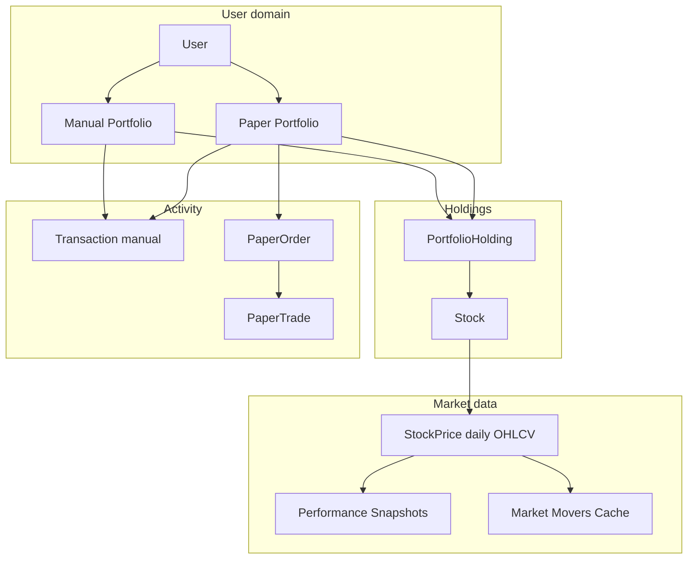

| Concept | Meaning |
|---------|---------|
| **User** | Owns portfolios, cash profile (`starting_cash`, `risk_profile`), credentials in separate table |
| **Manual portfolio** | Track holdings you bought outside the app; **no cash ledger** — buys/sells update holdings only unless explicitly flagged |
| **Paper portfolio** | Simulated brokerage account with **`cash_balance`**; all paper trades debit/credit cash |
| **Holding** | One row per `(portfolio, stock)` — quantity, weighted average cost, realized PnL |
| **Transaction** | Immutable audit of manual or paper-linked buys/sells |
| **Paper order** | Intent to trade; only **MARKET** orders execute immediately in MVP |
| **Signal** | Strategy output (BUY/SELL/HOLD) with suggested quantity; can be converted to paper order |
| **Ingestion run** | Audit record for each bulk Yahoo sync job |

**Portfolio types at registration**

On `POST /auth/register`, the system creates two default portfolios:

| Name | Type | Starting cash | Cash behavior |
|------|------|---------------|---------------|
| Manual Portfolio | `manual` | ₹0 | Cash not tracked |
| Paper Trading | `paper` | User's `starting_cash` (default ₹10L) | `cash_balance` decremented on buy, incremented on sell |

---

### 13.2 Authentication & authorization logic

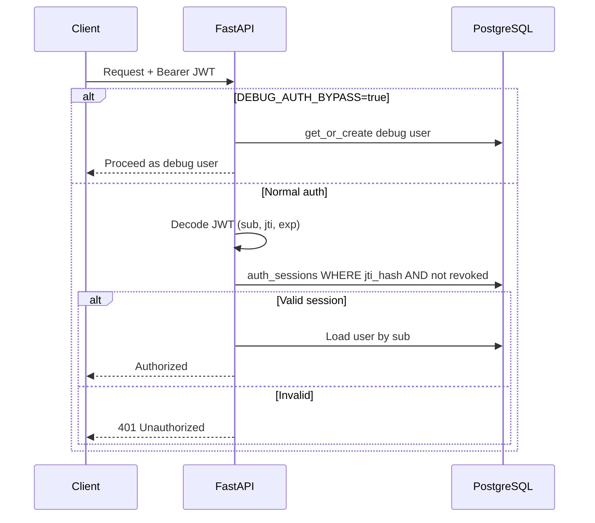

| Rule | Implementation |
|------|----------------|
| Password storage | bcrypt hash in `user_credentials` only — never in `users` |
| Session binding | JWT `jti` stored as SHA-256 hash in `auth_sessions` |
| Logout | Sets `revoked_at` on session — token cannot be reused |
| Token TTL | `ACCESS_TOKEN_EXPIRE_MINUTES` (default 24h) |
| Production guard | `APP_ENV=production` rejects default JWT secret and debug bypass |
| Resource ownership | Portfolios, orders, signals filtered by `user_id`; `_lock_portfolio()` uses `SELECT … FOR UPDATE` |

**Debug bypass (local Docker only)**

When `DEBUG_AUTH_BYPASS=true`, every API call runs as a fixed debug user — no login required. Streamlit mirrors this via `PAPER_TRADING_DEBUG_AUTH_BYPASS`.

---

### 13.3 Portfolio accounting rules

#### 13.3.1 Weighted average cost (buy)

When shares are bought, **brokerage/charges are included in average cost**:

```
effective_buy_price = (quantity × price + charges) / quantity
```

For an existing holding:

```
new_avg = (old_qty × old_avg + qty × effective_buy_price) / (old_qty + qty)
total_invested = new_avg × new_qty
```

**Implementation:** `portfolio_service.update_holding_after_buy()`

#### 13.3.2 Realized PnL (sell)

On sell:

```
realized_pnl_increment = (sell_price - average_buy_price) × quantity - charges
holding.realized_pnl += realized_pnl_increment
remaining_qty = old_qty - quantity
total_invested = average_buy_price × remaining_qty
```

If `remaining_qty <= 0`, the holding row is deleted.

**Implementation:** `portfolio_service.update_holding_after_sell()`

#### 13.3.3 Portfolio valuation

For each holding with `quantity > 0`:

```
latest_price = MAX(stock_prices.close) for stock_id   // fallback: average_buy_price
market_value = quantity × latest_price
unrealized_pnl = (latest_price - average_buy_price) × quantity
return_pct = unrealized_pnl / total_invested × 100
```

Portfolio totals:

```
invested_value = Σ total_invested
market_value   = Σ holding market_value
cash_balance   = portfolio.cash_balance   (paper only; manual → 0)
total_value    = market_value + cash_balance
realized_pnl   = Σ holding.realized_pnl
unrealized_pnl = Σ holding unrealized_pnl
```

**Total return %**

| Portfolio type | Formula |
|----------------|---------|
| Paper (with starting value) | `(total_value - starting_value) / starting_value × 100` |
| Manual / other | `(realized_pnl + unrealized_pnl) / invested_value × 100` |

**Implementation:** `portfolio_service.calculate_portfolio_value()`

#### 13.3.4 Cash update rules

| Action | Manual portfolio | Paper portfolio |
|--------|------------------|-----------------|
| Manual buy (Add Portfolio page) | Holdings only | Cash debited if `update_cash=True` or type is paper |
| Manual sell | Holdings only | Cash credited for paper |
| Paper MARKET order | N/A | Always updates cash via `add_manual_buy/sell(..., update_cash=True)` |

Cash check before buy:

```
if cash_balance < (quantity × price + charges): reject "Insufficient cash"
```

**Concurrency:** `_lock_portfolio()` acquires row-level lock (`FOR UPDATE`) before any buy/sell/paper order to prevent double-spend.

#### 13.3.5 Daily snapshots

`generate_daily_snapshot()` upserts one row per portfolio per calendar day:

```
day_pnl = today.total_value - yesterday.total_value
```

Used for portfolio value charts on Explore (up to 365 days).

---

### 13.4 Paper trading execution logic

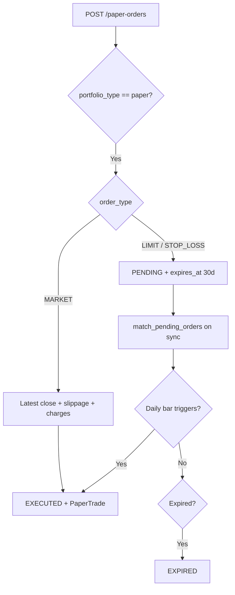

| Rule | Detail |
|------|--------|
| MARKET execution | `compute_execution_price` (tier slippage) + `compute_charges` (delivery, NSE/BSE) |
| LIMIT fill | BUY if `low ≤ limit` @ limit price; SELL if `high ≥ limit` @ limit (no slippage) |
| STOP_LOSS fill | Trigger on high/low; execution at stop ± slippage |
| Expiry | 30 calendar days → `EXPIRED` |
| Matcher trigger | End of `sync_stock_prices`; end of `start_market_sync`; `POST /paper-orders/match` |
| Charges in PnL | `add_manual_buy/sell` with real charges; cost basis includes fees |
| Audit trail | `paper_trades`: `quoted_price`, `slippage_*`, `charges_breakdown` JSONB |

**Strategy → paper path:** `execute_signal_as_paper_order()` converts a `StrategySignal` with `signal_type ∈ {BUY, SELL}` and `suggested_quantity > 0` into a MARKET paper order on the strategy's linked portfolio.

---

### 13.5 Market data ingestion logic

#### 13.5.1 Ticker normalization

| Exchange | Raw symbol | Yahoo symbol |
|----------|------------|--------------|
| NSE | `RELIANCE` | `RELIANCE.NS` |
| BSE | `500325` | `500325.BO` |

Tickers are loaded separately from prices (`load_indian_tickers.py` → `stocks` table).

#### 13.5.2 Sync modes

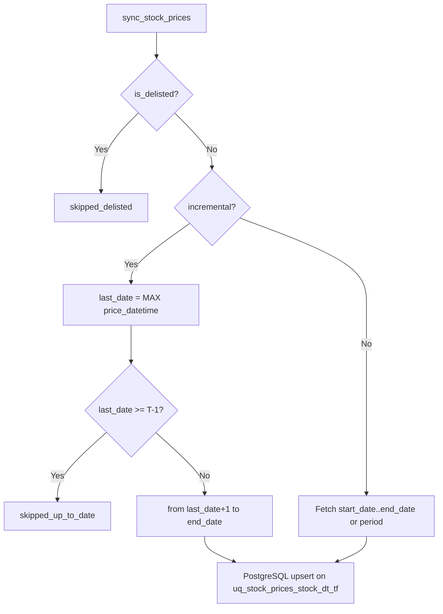

| Concept | Rule |
|---------|------|
| **T-1 end date** | `previous_business_day()` — sync never claims today's incomplete candle as final |
| **Incremental skip** | If DB already has candles through T-1, symbol skipped (0 rows saved) |
| **Idempotency** | Upsert on `(stock_id, price_datetime, timeframe)` — safe to re-run |
| **Delisted** | `is_delisted=true` stocks skipped; Yahoo delist errors can flag via `delisted_registry_service` |
| **Date window guard** | Filters Yahoo response to requested date range (prevents stale "latest" candle pollution) |

#### 13.5.3 Bulk sync (`sync_all_active_stocks`)

1. Creates `ingestion_runs` row with `status=RUNNING`
2. Selects active stocks (optional exchange/limit/offset)
3. Parallel path: batch Yahoo download (200 symbols) + worker pool (up to 32)
4. Updates run with `success_count`, `failed_count`, `rows_saved`
5. Final status: `SUCCEEDED` | `PARTIAL` | `FAILED`

**API cap:** `POST /stocks/sync-all` limited to **25 symbols** — full universe uses CLI (`ingest_market_history.py`) or Explore **Sync now** (`POST /market/sync`).

#### 13.5.4 Explore sync UX (business policy)

| Policy | Reason |
|--------|--------|
| No auto-sync on page load | Avoid burning Yahoo API calls |
| **Sync now** = explicit user action | User controls when to fetch |
| Session scheduler only while tab open | No background sync after leaving Explore |
| First scheduled sync after interval | Not immediately on toggle |

Background sync path: `start_market_sync()` → thread → `sync_all_active_stocks(incremental=True)` → `refresh_all_analytics()`.

---

### 13.6 Analytics & market intelligence logic

#### 13.6.1 T-1 market movers

SQL ranks each stock's last two daily candles **before today's UTC midnight**:

```
change_pct = (latest_close - previous_close) / previous_close × 100
```

Filters: active stocks, non-null closes, `previous_close ≠ 0`.

Output buckets (default top **50** each):

| Bucket | Sort |
|--------|------|
| Top gainers | `change_pct DESC` where `change_pct > 0` |
| Top losers | `change_pct ASC` where `change_pct < 0` |
| Volume leaders | `latest_volume DESC` |

Result cached in `market_analytics_cache` under key `market_movers_t1_v1`. Sparklines = last 14 closes per stock.

#### 13.6.2 Stock performance (1M / 3M / 6M / 1Y)

For each stock, SQL finds:

1. **Latest** daily close
2. **Anchor** closes: nearest candle at or before `latest_date - 1M/3M/6M/1Y`

```
change_Xm_pct = (latest - anchor) / anchor × 100
```

**Fast path:** `list_stock_performance()` reads precomputed `stock_performance_snapshots` (refreshed by `refresh_analytics.py` or post-sync).

#### 13.6.3 Sequential rankings

`generate_sequential_rankings()` scans stocks with enough history, runs **SequentialDeepLearningProxyStrategy** (momentum/volatility sequence score), ranks:

- **Top buys** — highest positive sequence scores among BUY signals
- **Top sells** — most negative among SELL signals

Cached as `sequential_rankings_v1`.

#### 13.6.4 Market overview fallback

Priority chain in `get_market_overview()`:

1. Live Yahoo index quotes (^NSEI, ^BSESN, …) — 5-minute in-memory cache
2. DB-stored index prices
3. Hardcoded sample data (clearly marked in UI)

Movers always prefer DB full-universe computation when eligible count > 0.

#### 13.6.5 Market trends (Trends page)

Period lookbacks (daily → annual) applied to stocks/index funds. Treemap sizing ≈ `latest_price × volume`; color = period change %. Filters by market universe and industry group.

---

### 13.7 Strategy & signal logic

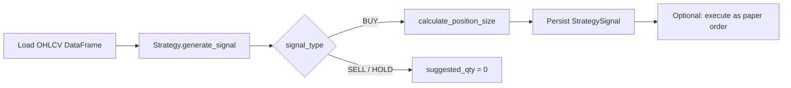

**Signal generation steps** (`generate_signal`):

1. Load user strategy + template parameters
2. Fetch price history (lookback varies by strategy type, max 10,000 rows)
3. Run `strategy.generate_signal(dataframe, params)` → `SignalResult`
4. If BUY: compute `suggested_quantity` via position sizing (uses `atr_stop['stop_pct']` from indicators when present)
5. Persist signal with confidence, reason, indicators JSON
6. If BUY or SELL: `create_signal_outcome_stub()` for forward outcome tracking

**ATR stop** (Wilder, on BUY/SELL signals with OHLCV):

```
TR = max(high-low, |high-prev_close|, |low-prev_close|)
ATR = EWM(TR, alpha=1/period)
stop_distance = ATR × atr_multiplier
BUY:  stop_price = entry - stop_distance; take_profit = entry + 2×stop_distance
SELL: stop_price = entry + stop_distance; take_profit = entry - 2×stop_distance
```

Stored in `indicators`: `atr`, `stop_price`, `stop_pct`, `stop_loss_pct` (alias), `take_profit_price`.

**Position sizing formula** (`risk_management.calculate_position_size`):

```
effective_stop_pct = atr_stop['stop_pct'] if atr_stop else stop_loss_pct (default 5%)
risk_amount        = portfolio_value × risk_per_trade_pct / 100
position_by_risk   = risk_amount / (effective_stop_pct / 100)
position_by_cap    = portfolio_value × max_position_size_pct / 100
affordable         = min(position_by_risk, position_by_cap, current_cash)
quantity           = floor(affordable / current_price)
```

Defaults: `risk_per_trade_pct=1%`, `max_position_size_pct=10%`.

**Outcome evaluation** (`evaluate_pending_outcomes`, run from `refresh_all_analytics`):

- After 5/10/20 trading days: fetch close from `stock_prices`, compute `return_Xd_pct` (SELL inverts sign for profitability)
- `stop_hit`: scan daily lows/highs vs `indicators.stop_price` through +20d
- Marks `outcome_evaluated_at` when 20d horizon is complete

**Preview vs generate**

| | Preview | Generate |
|---|---------|----------|
| Persists signal | No | Yes |
| Requires user strategy | No (template only) | Yes |
| Supports index funds | Yes | Stocks only (generate path) |

---

### 13.8 Backtest simulation logic

Simplified **single-position, daily-bar** simulator:

```
state: cash, quantity, average_price
for each bar in date range:
    signal = strategy.generate_signal(history_up_to_bar)
    if BUY and flat and cash > price:
        size = calculate_position_size(...)
        buy; update cash, quantity, average_price
    elif SELL and quantity > 0:
        sell all; realize PnL; quantity = 0
    record equity = cash + quantity × close
```

**Metrics computed**

| Metric | Formula |
|--------|---------|
| `total_return_pct` | `(final_value - initial_capital) / initial_capital × 100` |
| `max_drawdown_pct` | Max peak-to-trough of equity curve |
| `sharpe_ratio` | `mean(daily_returns) / std × √252` |
| `win_rate` | Winning SELL trades / total SELL trades × 100 |

Supports both **stocks** and **index funds**. Each simulated fill applies tier slippage (`slippage_bps` request param) and `compute_charges`; response includes `total_charges`. Still single-position only — no partial fills or multi-leg portfolios.

**Walk-forward mode** (`BacktestRunRequest.walk_forward = true`):

1. Split date range: first **70%** in-sample (IS), last **30%** out-of-sample (OOS)
2. Run `_simulate_backtest` on each slice with same parameters
3. Response includes IS and OOS metrics; `overfitting_score = oos_sharpe / is_sharpe`
4. Persisted on `backtest_runs`: `walk_forward_enabled`, `is_sharpe_ratio`, `oos_sharpe_ratio`, `oos_total_return_pct`, `oos_max_drawdown_pct`, `overfitting_score`

| Overfitting score | Interpretation |
|-------------------|----------------|
| &gt; 0.7 | Likely generalizes (green in UI) |
| 0.4 – 0.7 | Moderate overfitting risk (amber) |
| &lt; 0.4 | Likely overfitted to IS period (red) |

---

### 13.9 Algo findings logic (Explore stock detail)

`generate_stock_algo_findings()` runs multiple deterministic proxies on stored OHLCV:

| Algo | Core idea | Data requirement |
|------|-----------|------------------|
| VWAP | Price vs volume-weighted typical price | Daily OHLCV |
| TWAP | Price vs time-weighted average | Daily OHLCV |
| OU process | Z-score vs rolling mean/std | Daily closes |
| Kalman filter | Residual from fair-value estimate | Daily closes |
| GARCH proxy | Short vs long volatility ratio | Daily OHLCV |
| Tree ensemble | Weighted feature score (momentum, RSI, vol) | Daily OHLCV |
| MACD | MACD(12,26,9) crossover + RSI filter | Daily OHLCV, ≥60 bars |
| MACD + RSI composite | Combined MACD cross + RSI zone scoring (algo-only) | Daily OHLCV |
| Sector rotation | Sector 1M momentum rank vs NIFTY500 universe | `stock_performance_snapshots` + sector |
| Sequential DL proxy | Sequence momentum/volatility score | ≥80 bars |
| Pairs / Avellaneda / Order book | **Placeholder** — needs external data |

Each finding returns: `action` (BUY/SELL/HOLD), `confidence_score`, `reason`, `indicators`, optional chart series.

Some algos explicitly label `status=daily_proxy` or `missing_data` when intraday/Level-2 data would be required in production.

---

### 13.10 System design decisions

| Decision | Rationale |
|----------|-----------|
| **Daily candles only** | Yahoo limits intraday history; simpler storage and scheduling |
| **Separate ticker load vs price sync** | Symbol universe changes slowly; prices need frequent updates |
| **Performance snapshots table** | Avoid expensive 1M/3M/6M/1Y SQL on every Explore page load |
| **JSONB analytics cache** | Movers/rankings reused across requests; refresh on sync or explicit POST |
| **Paper vs manual portfolios** | Manual = tracking real holdings; paper = simulated cash + orders |
| **Charges in average cost** | More accurate cost basis for PnL than excluding fees |
| **`FOR UPDATE` portfolio locks** | Prevent race conditions on concurrent paper orders |
| **Incremental sync default** | Minimize Yahoo calls — only fetch missing dates |
| **API bulk cap (25 symbols)** | Protect server from accidental full-universe sync via HTTP |
| **Streamlit + FastAPI split** | UI decoupled from API — same backend usable by other clients |
| **Auth sessions table** | Server-side revocation (logout) unlike pure stateless JWT |
| **No auto-sync in UI** | User controls API cost and sync timing |

### 13.11 Error handling & edge cases

| Scenario | System behavior |
|----------|-----------------|
| No price for stock | Paper order rejected; may attempt 5d sync first |
| Yahoo rate limit / 401 | Ingestion marks failures in `ingestion_runs`; partial status |
| Delisted symbol | Skipped on sync; flagged in `stocks.is_delisted` |
| Zero quantity sell | Rejected — insufficient holding |
| LIMIT not filled in 30d | Status `EXPIRED` |
| SMTP not configured | Password reset / signal emails skipped silently |
| Risk metrics thin history | Beta/VaR/drawdown return `insufficient_data` (not 500) |
| Stale ingestion run (`RUNNING` > 6h) | Marked FAILED by `market_sync_service` cleanup |
| Missing sector/industry | Shown as `-` in UI; only ~771/6780 enriched via Yahoo metadata |
| Sample fallback movers | UI warning when live + DB both unavailable |

### 13.12 Key business formulas (quick reference)

```
# Holding average after buy
new_avg = (old_qty × old_avg + buy_qty × effective_price) / (old_qty + buy_qty)

# Unrealized PnL
unrealized = (market_price - avg_cost) × quantity

# Realized PnL on sell
realized = (sell_price - avg_cost) × quantity - charges

# Portfolio total value
total = Σ(qty × latest_price) + cash_balance

# T-1 mover change
change_pct = (close_t-1 - close_t-2) / close_t-2 × 100

# Period performance
change_1y_pct = (latest_close - close_1y_ago) / close_1y_ago × 100

# Position size (ATR-aware)
effective_stop = indicators.stop_pct or fixed stop_loss_pct
qty = floor(min(risk_based_cap, max_position_cap, cash) / price)

# Walk-forward overfitting
overfitting_score = oos_sharpe / is_sharpe

# Slippage
executed_buy = quoted * (1 + slippage_bps/10000)
executed_sell = quoted * (1 - slippage_bps/10000)

# Charges (delivery) — STT on trade_value, not PnL
total_charges = stt + brokerage + exchange + sebi + gst + stamp_duty
```

---

## 14. User feature guide — how to use the app

Step-by-step guide for each Streamlit page. Open **http://localhost:8501** after `py -3 scripts/run.py -d`. Log in on the home page (or use debug auth bypass in local Docker).

### 14.1 Home — login & registration

| Step | Action |
|------|--------|
| 1 | Enter email + password → **Login** |
| 2 | New user → switch to **Register**: name, username, email, password, optional starting paper cash |
| 3 | After login, use the sidebar to open any page |

Password reset API exists (`POST /auth/forgot-password`); dedicated reset page may be added later.

### 14.2 Explore (`1_Explore.py`)

**Purpose:** Market pulse, sync prices, screen the full universe, drill into one stock.

| Area | How to use |
|------|------------|
| **Market overview** | Index levels, top gainers/losers/volume (from DB or live Yahoo fallback) |
| **Sync now** | One-shot incremental sync for all active stocks + analytics refresh. Does **not** run automatically on page load |
| **Session scheduler** | Optional 15m–4h repeat sync while this browser tab stays open |
| **All stocks table** | Filter by exchange, sector, industry; sort by volume, price, 1Y change, etc. Columns `1M/3M/6M/1Y Change` are rolling % from latest close |
| **Stock detail** | Search or click a row → price chart, fundamentals snippet, **algo findings** (VWAP, MACD, OU, GARCH, …), **strategy preview** (dry-run signal without saving) |

**Tip:** Run `scripts/enrich_stock_metadata.py` if sector/industry filters are empty.

### 14.3 Add Portfolio (`2_Add_Portfolio.py`)

**Purpose:** Create portfolios and record **manual** (real-tracking) buys.

1. **Create portfolio** — name, type (manual/paper), starting cash.
2. **Manual buy** — select portfolio, search stock, quantity, price, optional notes/charges.
3. Holdings update average cost and cash balance.

Use a **paper** portfolio for simulated trading on the Paper Trading page.

### 14.4 Paper Trading (`3_Paper_Trading.py`)

**Purpose:** Simulate orders against latest daily prices with Indian charges and slippage.

| Order type | Behavior |
|------------|----------|
| **MARKET** | Fills immediately at latest close + slippage + `compute_charges` |
| **LIMIT** | `PENDING` until daily bar shows `low ≤ limit` (buy) or `high ≥ limit` (sell); 30-day expiry |
| **STOP_LOSS** | Triggers on bar high/low; fill at stop ± slippage |

**Workflow**

1. Select **paper** portfolio and stock.
2. Choose side, quantity, order type; optional **notes** and **slippage_bps** override.
3. Place order → view orders/trades; **Match Now** or wait for price sync to run matcher.
4. Candlestick chart shows OHLCV for the symbol (sync single stock if stale).

PnL and charges appear on trades; portfolio cash and holdings update on fill.

### 14.5 Strategy Lab (`4_Strategy_Lab.py`)

**Purpose:** Configure strategies and generate or execute **signals**.

1. Pick a **strategy template** (RSI, SMA, MACD, sector rotation, …).
2. Link to a **paper portfolio** and tune parameters (defaults tuned for Indian daily data).
3. **Preview signal** — run on a stock without saving (Explore-style).
4. **Generate signal** — persists `strategy_signals` + outcome stub for forward testing.
5. **Execute as paper order** — converts BUY/SELL with `suggested_quantity` into a MARKET paper order.

Signals include ATR-based `stop_price` / `stop_pct` in `indicators` JSON when applicable.

### 14.6 Backtesting (`5_Backtesting.py`)

**Purpose:** Historical simulation on one stock or index fund.

1. Select user strategy (or template), instrument, date range, capital.
2. Optional **Walk-Forward Validation** — 70% in-sample / 30% out-of-sample; shows overfitting score (OOS Sharpe / IS Sharpe).
3. Run → equity curve, trades, Sharpe, max drawdown, win rate.
4. Slippage and charges applied per simulated fill.

Use results as input to **AI Think Tank → Backtest Interpreter** (plain-English explanation).

### 14.7 Data (`6_Data.py`)

**Purpose:** Read-only ingestion health — coverage %, last sync, failed symbols, latest price date. No trading actions.

### 14.8 Index Fund (`7_Index_Fund.py`)

**Purpose:** Index and commodity funds (^NSEI, gold, etc.) — list, sync prices, period returns, algo findings. Same daily-bar logic as stocks.

### 14.9 Trends (`8_Trends.py`)

**Purpose:** Treemap of market or index universe — box size ≈ liquidity, color = period return (1D → 1Y). Filter by industry group.

### 14.10 Risk (`9_Risk.py`)

**Purpose:** Portfolio risk vs NIFTY 50.

1. Select portfolio → **Refresh risk metrics**.
2. View **beta**, **1-day VaR (95%)**, **concentration** (top holding %, HHI), **max drawdown** vs benchmark.
3. Requires sufficient `portfolio_daily_snapshot` history and `^NSEI` index prices.

### 14.11 AI Think Tank (`10_AI_Think_Tank.py`)

**Purpose:** Educational LLM analysis via **local Ollama** (not financial advice).

**Prerequisites**

1. `AI_FEATURES_ENABLED=true` in backend env; restart API.
2. `ollama serve` on the host; `ollama pull <model>` (e.g. `qwen3:14b` or any model you select in the sidebar).
3. Docker backend: `OLLAMA_BASE_URL=http://host.docker.internal:11434`.

If Ollama is down, the page shows a setup banner. If AI is disabled, it shows the env-var message.

**Sidebar — AI Settings**

- Lists models from `GET /ai/status`.
- **Model** dropdown — passed as `model` on every AI API call (use a model you have pulled).

#### Tab 1 — Signal Synthesizer

| Step | Action |
|------|--------|
| 1 | Search and select a stock |
| 2 | Expand **Raw algo findings** (from `/stocks/{id}/algo-findings`) |
| 3 | Click **Synthesise Signals** |

**What happens:** API sends all findings to the LLM with rules (weight MACD/RSI/VWAP over statistical proxies; consensus if ≥60% agree). Returns headline, summary, BULLISH/BEARISH/MIXED/NEUTRAL, strength 0–100, key risk. **Cached 24h** per symbol.

#### Tab 2 — Backtest Interpreter

| Step | Action |
|------|--------|
| 1 | Run at least one backtest on page 5 |
| 2 | Select a run from the dropdown |
| 3 | Click **Interpret Results** |

**What happens:** API loads metrics from DB (not from the UI), LLM explains Sharpe/drawdown/OOS/overfitting in plain English → verdict STRONG/ACCEPTABLE/WEAK/OVERFIT, red flags. **Cached permanently** per `backtest_id`.

#### Tab 3 — Pre-Trade Advisor

| Step | Action |
|------|--------|
| 1 | Select paper portfolio + stock |
| 2 | BUY/SELL, quantity, price, **your reasoning** in the text area |
| 3 | Click **Check My Reasoning** |

**What happens:** LLM compares your notes to algo signals and concentration risk; returns quality STRONG/ADEQUATE/THIN, positives, considerations (educational only — never “don’t trade”). **Not cached** (per request).

#### Tab 4 — Natural Language Screener

| Step | Action |
|------|--------|
| 1 | Type a question, e.g. *“IT stocks that fell this year but recovered last month”* |
| 2 | Or click an example chip |
| 3 | Click **Find Stocks** |

**Query decomposition (detailed)** — see [§8.3](#83-ai-think-tank-ollama). Short version:

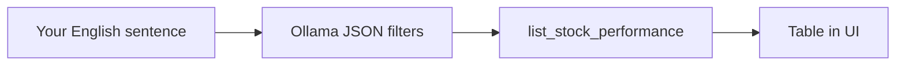

- LLM maps phrases to **min/max** on `change_1m/3m/6m/1y_pct` (rolling from **today**, not calendar years).
- UI shows **explanation** and **confidence**; if **LOW**, confirm before trusting filters.
- Matching stocks listed with key columns; **cached 1h** per query text.

**Example:** *“Good last year, fallen tremendously this year”* → often `min_change_1y_pct: 20`, `max_change_6m_pct: -10` (strong vs 12m ago, weak vs 6m ago).

#### Tab 5 — Portfolio Health

| Step | Action |
|------|--------|
| 1 | Select portfolio |
| 2 | Click **Analyse Portfolio** |

**What happens:** Loads holdings, risk metrics, recent trades → ~200-word narrative, health score 0–100, top concern. **Cached 1h** per portfolio.

#### Tab 6 — Journal Insights

| Step | Action |
|------|--------|
| 1 | Select portfolio with **≥10** paper trades (notes from orders help) |
| 2 | Click **Analyse My Trading** |

**What happens:** LLM scans notes for patterns, biases (FOMO, overtrading), strengths. Encouraging tone. **Cached 6h**.

#### Tab 7 — Activity Log

| Step | Action |
|------|--------|
| 1 | Click **Refresh logs** after running actions |
| 2 | Expand a row |

Shows DB audit: model, Ollama connected, cache hit, **full LLM query/response**, API request/response, duration, errors.

**Terminal debugging**

```powershell
docker logs paper_trading_backend -f    # app.ai, ollama_chat_*
docker logs paper_trading_frontend -f   # frontend.ai, think_tank_ui
```

### 14.12 Quick reference — which page for what?

| Goal | Page |
|------|------|
| Sync all stock prices | Explore → Sync now |
| Screen by sector/momentum | Explore table or AI NL Screener |
| Paper trade with limits | Paper Trading |
| Run RSI/MACD/etc. live | Strategy Lab |
| Test strategy historically | Backtesting |
| Understand backtest results | AI Think Tank → Backtest Interpreter |
| Portfolio beta / VaR | Risk |
| Index/gold data | Index Fund |
| Market heatmap | Trends |
| Ingestion status | Data |
| Audit AI prompts | AI Think Tank → Activity Log |

### 14.13 Educational disclaimer

All strategies, backtests, algo findings, and AI Think Tank outputs are for **learning and paper simulation only**. They are not investment recommendations. Past simulated performance does not guarantee future results.

---

## Appendix: Yahoo symbol mapping

| Exchange | Input | Yahoo symbol |
|----------|-------|--------------|
| NSE | `RELIANCE` | `RELIANCE.NS` |
| BSE | `500325` | `500325.BO` |

Indices use `^NSEI` (NIFTY 50), `^BSESN` (SENSEX), etc.

---

*Generated for AI context and developer onboarding. Last major updates: AI Think Tank + Ollama NL screener (§8.3, §14.11); `ai_action_logs` (0019); strategy engine (§8.1); trading firm standards (§8.2); full user feature guide (§14).*
