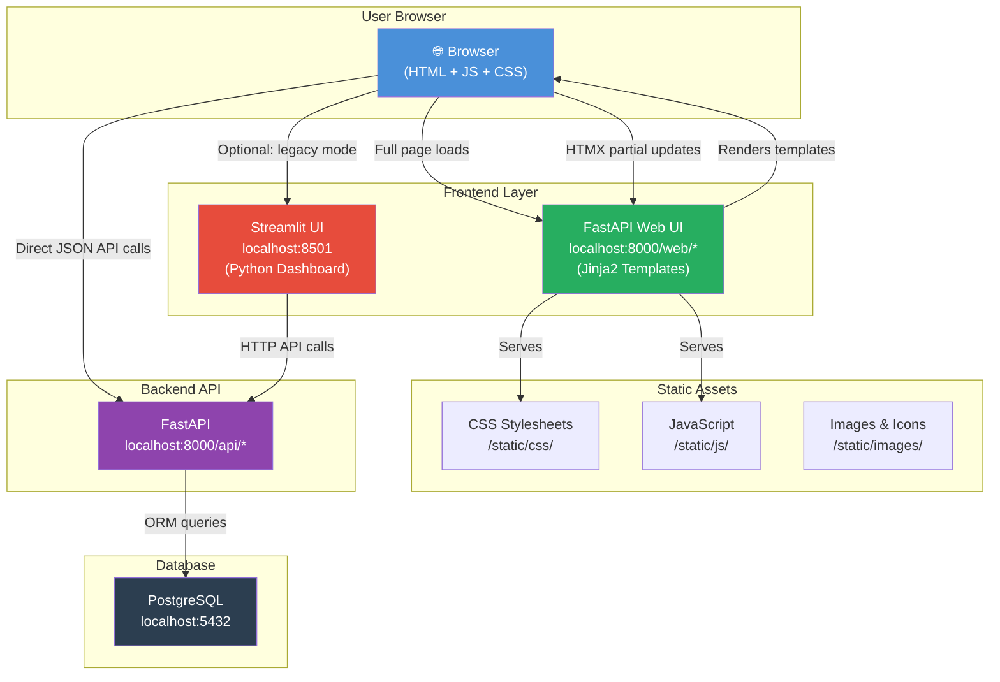
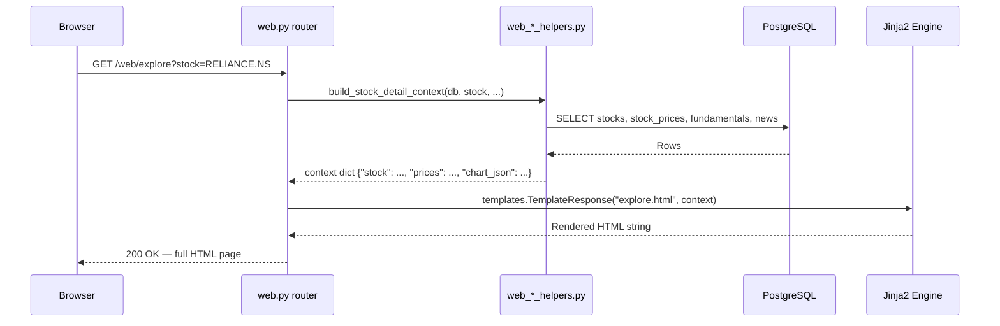
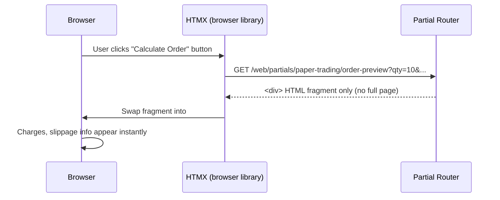
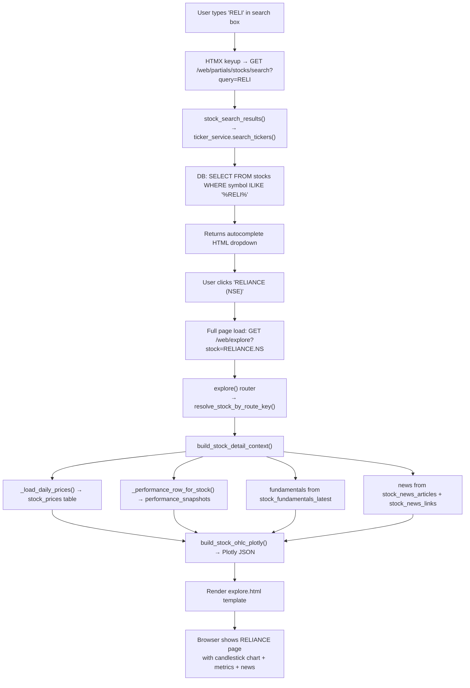
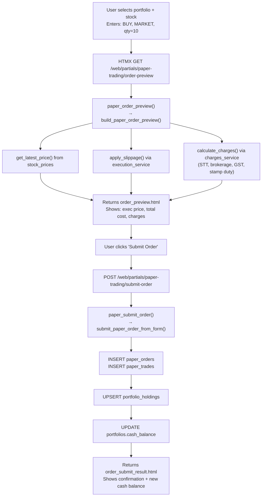
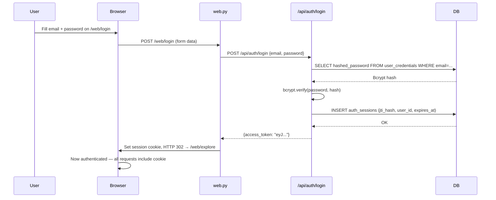
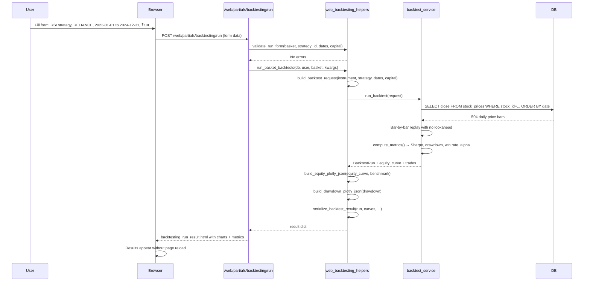
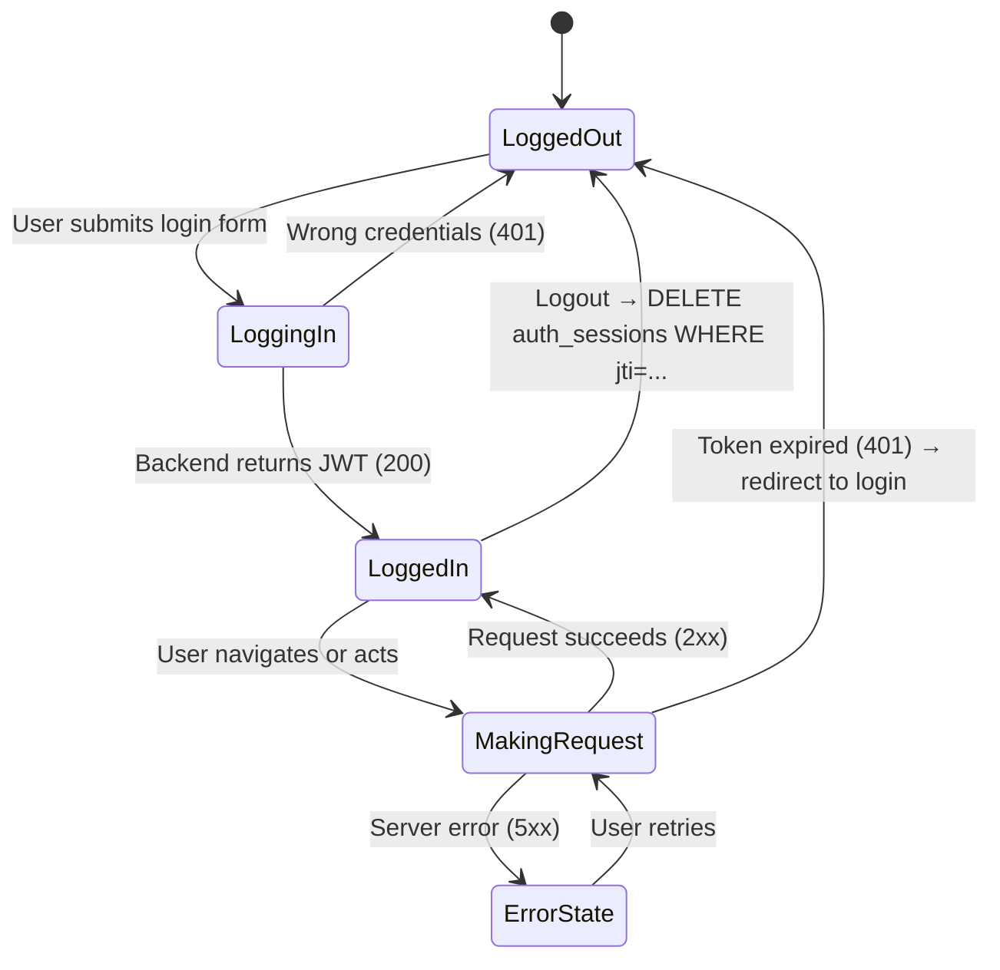
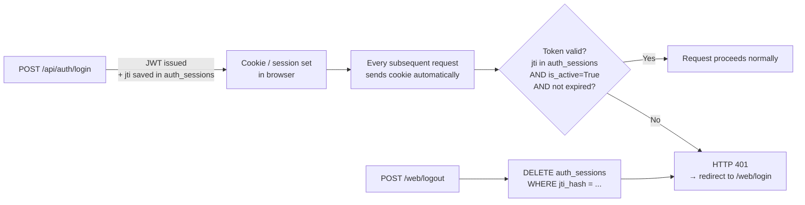

# KT-01: Frontend Knowledge Transfer
### Paper Trading App — New Intern Onboarding Guide

---

## Table of Contents
1. [What is the Frontend?](#1-what-is-the-frontend)
2. [Tech Stack Overview](#2-tech-stack-overview)
3. [System Architecture](#3-system-architecture)
4. [Directory Structure](#4-directory-structure)
5. [Primary UI: FastAPI Web UI](#5-primary-ui-fastapi-web-ui)
6. [Web Router — Full Page Routes (web.py)](#6-web-router--full-page-routes-webpy)
7. [Partial Routers — HTMX Fragment Routes](#7-partial-routers--htmx-fragment-routes)
   - 7a. [Explore Partials](#7a-explore-partials--webpartials)
   - 7b. [Stock Detail Partials](#7b-stock-detail-partials)
   - 7c. [Paper Trading Partials](#7c-paper-trading-partials)
   - 7d. [Strategy Lab Partials](#7d-strategy-lab-partials)
   - 7e. [Backtesting Partials](#7e-backtesting-partials)
   - 7f. [Data Operations Partials](#7f-data-operations-partials)
   - 7g. [AI Think Tank Partials](#7g-ai-think-tank-partials)
8. [Service Helpers — Function Reference](#8-service-helpers--function-reference)
   - 8a. [web_explore_stock_helpers.py](#8a-web_explore_stock_helperspy)
   - 8b. [web_trading_helpers.py](#8b-web_trading_helperspy)
   - 8c. [web_backtesting_helpers.py](#8c-web_backtesting_helperspy)
   - 8d. [web_strategy_lab_helpers.py](#8d-web_strategy_lab_helperspy)
   - 8e. [web_data_helpers.py](#8e-web_data_helperspy)
   - 8f. [web_ai_think_tank_helpers.py](#8f-web_ai_think_tank_helperspy)
   - 8g. [web_nl_screener_service.py](#8g-web_nl_screener_servicepy)
9. [Legacy UI: Streamlit](#9-legacy-ui-streamlit)
   - 9a. [api_client.py — Function Reference](#9a-api_clientpy--function-reference)
   - 9b. [ui.py — Component Reference](#9b-uipy--component-reference)
   - 9c. [streamlit_app.py — Entry Point](#9c-streamlit_apppy--entry-point)
   - 9d. [Pages — Function Reference](#9d-pages--function-reference)
10. [Page-by-Page Breakdown & Data Flows](#10-page-by-page-breakdown--data-flows)
11. [Component & Template Hierarchy](#11-component--template-hierarchy)
12. [Request Flow Diagrams](#12-request-flow-diagrams)
13. [State & Auth Flow](#13-state--auth-flow)
14. [HTMX Patterns Cheat Sheet](#14-htmx-patterns-cheat-sheet)
15. [How to Run Locally](#15-how-to-run-locally)
16. [Common Tasks for Interns](#16-common-tasks-for-interns)
17. [Quick Reference Card](#17-quick-reference-card)

---

## 1. What is the Frontend?

The Paper Trading App has **two frontend systems** that co-exist:

| UI | Technology | Default? | Port | When to use |
|----|-----------|---------|------|-------------|
| **Web UI** | FastAPI + Jinja2 + HTMX | ✅ Yes | 8000 | Primary — what all users see |
| **Streamlit UI** | Streamlit (Python) | ❌ Legacy/Optional | 8501 | Power users / data exploration |

**The primary UI** is rendered server-side by the FastAPI backend itself — HTML pages are templated using Jinja2 and served from `http://localhost:8000/web/*`. There is no separate Node.js or React server.

**The Streamlit UI** is a legacy Python-based dashboard kept for backwards compatibility. It is disabled by default and can be enabled via a toggle in the web UI.

> **Why two UIs?** The app started with Streamlit (fast to prototype, zero JS needed). As requirements grew, a more customizable HTML/CSS/JS approach was adopted using Jinja2 templates served from FastAPI. The Streamlit UI still exists for teams that prefer it.

---

## 2. Tech Stack Overview

```
┌─────────────────────────────────────────────────────────────┐
│                    BROWSER (User Device)                     │
│                                                              │
│  HTML5 + CSS3 + JavaScript                                   │
│  HTMX (partial page updates via HTTP — no React needed)      │
│  Plotly.js (interactive stock charts)                        │
└──────────────────────┬──────────────────────────────────────┘
                       │ HTTP/HTTPS requests
┌──────────────────────▼──────────────────────────────────────┐
│               FastAPI Backend (Port 8000)                    │
│                                                              │
│  Jinja2 templating engine → renders HTML server-side         │
│  Static files served from /static/ (CSS, JS, images)        │
│  Full pages at /web/*  |  HTMX partials at /web/partials/*  │
└──────────────────────┬──────────────────────────────────────┘
                       │ SQLAlchemy ORM
┌──────────────────────▼──────────────────────────────────────┐
│               PostgreSQL Database (Port 5432)                │
└─────────────────────────────────────────────────────────────┘
```

### Libraries Used

| Library | Version | Where | Purpose |
|---------|---------|-------|---------|
| Jinja2 | 3.1.6 | Backend | Server-side HTML templating |
| HTMX | CDN | Browser | Partial HTML updates without full page reload |
| Plotly | 5.24.1 | Backend + Browser | Interactive OHLCV and equity charts |
| Streamlit | 1.41.1 | Frontend container | Legacy Python UI framework |
| Requests | 2.32.3 | Frontend container | HTTP calls from Streamlit to backend API |
| Pandas | 2.2.3 | Both | Data manipulation for display |

---

## 3. System Architecture



---

## 4. Directory Structure

```
paper_trading_app/
│
├── backend/app/
│   ├── templates/                         ← Jinja2 HTML templates (Web UI)
│   │   ├── base.html                     ← Master layout: nav, head, footer
│   │   ├── explore.html                  ← Market overview + stock detail
│   │   ├── add_portfolio.html            ← Portfolio creation form
│   │   ├── paper_trading.html            ← Order placement page
│   │   ├── strategy_lab.html             ← Strategy creation + signals
│   │   ├── backtesting.html              ← Backtest form + results
│   │   ├── data.html                     ← Data sync + DB management
│   │   ├── index_fund.html               ← Index fund / ETF tracker
│   │   ├── trends.html                   ← Sector & period trends
│   │   ├── risk.html                     ← Portfolio risk dashboard
│   │   ├── ai_think_tank.html            ← LLM-powered analysis
│   │   └── partials/                     ← HTMX partial templates
│   │       ├── stock_search_results.html ← Autocomplete dropdown
│   │       ├── explore_index_cards.html  ← Market indices cards
│   │       ├── explore_top_movers.html   ← Top gainers/losers list
│   │       ├── explore_all_stocks.html   ← Filterable stock list
│   │       ├── order_preview.html        ← Order charges preview
│   │       ├── order_submit_result.html  ← Order confirmation
│   │       ├── open_positions.html       ← Holdings table
│   │       ├── order_history.html        ← Order book
│   │       ├── strategy_lab_params.html  ← Strategy parameter controls
│   │       ├── strategy_lab_signal_preview.html ← Signal output
│   │       ├── backtesting_run_result.html ← Backtest metrics
│   │       ├── ai_analysis_result.html   ← LLM response display
│   │       └── ...                       ← Many more partials
│   │
│   ├── static/                            ← Static assets
│   │   ├── css/                          ← Stylesheets
│   │   └── js/                           ← Client-side JavaScript
│   │
│   └── routers/
│       ├── web.py                        ← Full page routes (/web/*)
│       ├── web_partials.py               ← Explore/general partials
│       ├── web_explore_stock_partials.py ← Stock detail partials
│       ├── web_paper_partials.py         ← Paper trading partials
│       ├── web_strategy_lab_partials.py  ← Strategy lab partials
│       ├── web_backtesting_partials.py   ← Backtesting partials
│       ├── web_data_partials.py          ← Data ops partials
│       └── web_ai_think_tank_partials.py ← AI analysis partials
│
└── frontend/                              ← Legacy Streamlit UI
    ├── streamlit_app.py                  ← Login/register entry point
    ├── api_client.py                     ← HTTP wrapper + utility functions
    ├── ui.py                             ← Reusable Streamlit components
    └── pages/                            ← Multipage Streamlit app
        ├── 01_Explore.py
        ├── 02_Add_Portfolio.py
        ├── 03_Paper_Trading.py
        ├── 04_Strategy_Lab.py
        ├── 05_Backtesting.py
        ├── 06_Data.py
        ├── 07_Index_Funds.py
        ├── 08_Trends.py
        ├── 09_Risk.py
        └── 10_AI_Think_Tank.py
```

---

## 5. Primary UI: FastAPI Web UI

### How Jinja2 Templating Works



### How HTMX Partial Updates Work

HTMX lets parts of the page update without a full reload. Think of it as lightweight React but entirely server-rendered:



### HTMX Attributes Quick Reference

```html
<!-- Trigger a GET request on button click, swap result into target -->
<button
  hx-get="/web/partials/paper-trading/order-preview"
  hx-target="#order-preview"
  hx-swap="innerHTML"
  hx-include="#order-form">
  Preview Order
</button>

<!-- Trigger on input change (e.g., stock search) -->
<input
  hx-get="/web/partials/stocks/search"
  hx-trigger="keyup changed delay:300ms"
  hx-target="#search-results"
  name="query" />

<!-- Show loading indicator while waiting -->
<div id="chart-container" hx-indicator="#spinner">
  <span id="spinner" class="htmx-indicator">Loading...</span>
</div>
```

---

## 6. Web Router — Full Page Routes ([web.py](../../backend/app/routers/web.py))

Every route in `web.py` renders a **full HTML page** using a Jinja2 template. These are what appear in the browser address bar.

| Function | Method | URL | Query Params | What It Does | Template Rendered |
|----------|--------|-----|-------------|-------------|-------------------|
| `web_home()` | GET | `/web/` | — | Redirects to `/web/explore` | — (302 redirect) |
| `explore()` | GET | `/web/explore` | `stock` (str), `start_date`, `end_date`, `chart_type` | Renders market overview with top movers, indices; if `stock` param given, also renders full stock detail with price chart, fundamentals, news, algorithm findings | `explore.html` |
| `add_portfolio_page()` | GET | `/web/add-portfolio` | `stock`, `stock_id`, `symbol`, `exchange` | Shows portfolio creation form and optional manual holding addition; preselects stock from URL params if provided | `add_portfolio.html` |
| `paper_trading_page()` | GET | `/web/paper-trading` | — | Renders paper trading order interface with portfolio and stock selection dropdowns, order type radio buttons | `paper_trading.html` |
| `trends_page()` | GET | `/web/trends` | — | Renders multi-period trend comparison dashboard for stocks across sectors and industries | `trends.html` |
| `risk_page()` | GET | `/web/risk` | — | Renders portfolio risk dashboard: exposure, concentration, max drawdown; defaults to 252-day lookback | `risk.html` |
| `backtesting_page()` | GET | `/web/backtesting` | — | Renders backtest setup form: strategy templates, execution modes, date ranges, cost models, benchmark options; loads all active strategy templates | `backtesting.html` |
| `strategy_lab_page()` | GET | `/web/strategy-lab` | — | Renders strategy lab: create user strategies, generate BUY/SELL/HOLD signals, view signal history | `strategy_lab.html` |
| `data_operations_page()` | GET | `/web/data` | — | Renders data operations and monitoring page: sync status, ingestion health, database stats | `data.html` |
| `ai_think_tank_page()` | GET | `/web/ai-think-tank` | — | Renders AI analysis page with analysis modes (signal synthesizer, backtest interpreter, portfolio health); loads backtest run list and available LLM models | `ai_think_tank.html` |
| `index_fund_page()` | GET | `/web/index-fund` | — | Renders index fund / ETF analysis and comparison page | `index_fund.html` |

---

## 7. Partial Routers — HTMX Fragment Routes

Partials return **HTML fragments** (not full pages). They are loaded into a specific `<div>` by HTMX without refreshing the full page.

### 7a. Explore Partials (`/web/partials/...`)

File: [web_partials.py](../../backend/app/routers/web_partials.py)

| Function | Method | URL | Parameters | What It Does | HTML Fragment |
|----------|--------|-----|-----------|-------------|--------------|
| `stock_search_results()` | GET | `/web/partials/stocks/search` | `query`, `q`, `exchange`, `selectable` (bool), `mode` | Fuzzy-searches stocks by symbol or name; records telemetry; if `selectable=true` also returns latest price and date | `stock_search_results.html` |
| `explore_index_cards()` | GET | `/web/partials/explore/index-cards` | — | Loads live market indices (NIFTY50, SENSEX, etc.), filters out placeholder/sample prices | `explore_index_cards.html` |
| `explore_top_movers()` | GET | `/web/partials/explore/top-movers` | `group`, `bucket`, `sort`, `index`, `direction` | Computes and returns top gainers / top losers / volume shockers, sorted by trend, price, or volume | `explore_top_movers.html` |
| `explore_all_stocks()` | GET | `/web/partials/explore/all-stocks` | `search`, `exchange`, `index`, `sector`, `industry`, `sort_by`, `limit` | Lists all stocks with performance data; filterable by exchange, sector, industry, and index membership | `explore_all_stocks.html` |
| `explore_sequential_rankings()` | GET | `/web/partials/explore/sequential-rankings` | `side` (BUY/SELL), `refresh` (bool) | Fetches or computes cached momentum/mean-reversion buy and sell ranked signals across the universe | `explore_sequential_rankings.html` |
| `explore_sync_status()` | GET | `/web/partials/explore/sync-status` | — | Fetches current market sync status and fundamentals ingestion progress | `sync_status.html` |
| `explore_sync_now()` | POST | `/web/partials/explore/sync-now` | — | Triggers a background market data sync; emits `HX-Trigger` event for UI refresh | `sync_status.html` |
| `explore_toggle_sync_schedule()` | POST | `/web/partials/explore/toggle-sync-schedule` | `enabled` (str) | Toggles the persistent market sync scheduler (UI layer only) | `sync_status.html` |

### 7b. Stock Detail Partials

File: [web_explore_stock_partials.py](../../backend/app/routers/web_explore_stock_partials.py)

| Function | Method | URL | Parameters | What It Does | HTML Fragment |
|----------|--------|-----|-----------|-------------|--------------|
| `explore_stock_strategy_preview()` | POST | `/web/partials/explore/stock-strategy-preview` | Form: `stock_id`, `strategy_template_id` | Generates a signal preview (BUY/SELL/HOLD + confidence + reason) for a stock using strategy default parameters | `stock_strategy_preview_result.html` |
| `explore_stock_news_refresh()` | POST | `/web/partials/explore/stock-news/{stock_id}/refresh` | Path: `stock_id` (int) | Fetches fresh news from external API for a stock; falls back to cached DB news if external call fails | `stock_news.html` |

### 7c. Paper Trading Partials

File: [web_paper_partials.py](../../backend/app/routers/web_paper_partials.py)

| Function | Method | URL | Parameters | What It Does | HTML Fragment |
|----------|--------|-----|-----------|-------------|--------------|
| `paper_order_preview()` | GET | `/web/partials/paper-trading/order-preview` | `portfolio_id`, `stock_id`, `side`, `order_type`, `quantity`, `limit_price`, `stop_price` | Calculates live order preview: estimated charges (brokerage, STT, GST), slippage, total cost; validates cash availability | `order_preview.html` |
| `paper_submit_order()` | POST | `/web/partials/paper-trading/submit-order` | Form: `portfolio_id`, `stock_id`, `side`, `order_type`, `quantity`, `limit_price`, `stop_price`, `notes` | Validates and submits a paper trading order; executes against stored prices, deducts cash, updates holdings | `order_submit_result.html` |
| `paper_open_positions()` | GET | `/web/partials/paper-trading/open-positions` | `portfolio_id` (int) | Fetches open holdings in a portfolio with current market value and unrealized PnL | `open_positions.html` |
| `paper_order_history()` | GET | `/web/partials/paper-trading/order-history` | `portfolio_id`, `limit` | Fetches recent paper orders (filled, cancelled, pending) for a portfolio | `order_history.html` |

### 7d. Strategy Lab Partials

File: [web_strategy_lab_partials.py](../../backend/app/routers/web_strategy_lab_partials.py)

| Function | Method | URL | Parameters | What It Does | HTML Fragment |
|----------|--------|-----|-----------|-------------|--------------|
| `instrument_search()` | GET | `/web/partials/strategy-lab/instrument-search` | `query`, `search_exchange`, `instrument_type`, `search_index_code`, `search_category`, `limit` | Searches stocks or index funds to use as a strategy signal target | `strategy_lab_search_results.html` |
| `stock_context_partial()` | GET | `/web/partials/strategy-lab/stock-context` | `stock_id`, `portfolio_id` | Builds context card: current price, user's existing holding, 1m/3m/6m/1y performance | `strategy_lab_stock_context.html` |
| `strategy_params()` | GET | `/web/partials/strategy-lab/strategy-params` | `strategy_id`, `advanced` (bool) | Renders parameter form controls for the selected strategy template (sliders, inputs for RSI period, SMA windows, etc.) | `strategy_lab_params.html` |
| `create_strategy_partial()` | POST | `/web/partials/strategy-lab/create-strategy` | Form: `portfolio_id`, `strategy_template_id`, `strategy_name`, `params_json`, `risk_per_trade_pct` | Creates and persists a user strategy instance with custom parameters | `strategy_lab_create_result.html` |
| `generate_signal_partial()` | POST | `/web/partials/strategy-lab/generate-signal` | Form: `user_strategy_id`, `stock_id` | Runs signal generation for one stock using the saved user strategy; persists signal to DB | `strategy_lab_signal_preview.html` |
| `signal_preview_partial()` | GET | `/web/partials/strategy-lab/signal-preview` | `stock_id`, `strategy_template_id`, `params_json`, `risk_per_trade_pct` | Previews a signal in real-time as user adjusts parameters — does NOT save to DB | `strategy_lab_signal_preview.html` |
| `user_strategies_partial()` | GET | `/web/partials/strategy-lab/user-strategies` | `portfolio_id`, `selected_user_strategy_id` | Lists all strategies the user has created, with their parameters and last signal date | `strategy_lab_user_strategies.html` |
| `activity_log_partial()` | GET | `/web/partials/strategy-lab/activity-log` | — | Shows a feed of recent signals generated across all user strategies | `strategy_lab_activity_log.html` |

### 7e. Backtesting Partials

File: [web_backtesting_partials.py](../../backend/app/routers/web_backtesting_partials.py)

| Function | Method | URL | Parameters | What It Does | HTML Fragment |
|----------|--------|-----|-----------|-------------|--------------|
| `instrument_search()` | GET | `/web/partials/backtesting/instrument-search` | `query`, `search_exchange`, `instrument_type`, `search_index_code`, `search_category`, `limit` | Searches for stocks or index funds to add to a backtest basket | `backtesting_search_results.html` |
| `strategy_params()` | GET | `/web/partials/backtesting/strategy-params` | `strategy_id`, `advanced` (bool) | Renders strategy parameter form for the selected strategy template | `backtesting_strategy_params.html` |
| `run_backtest_partial()` | POST | `/web/partials/backtesting/run` | Form: strategy_id, basket, dates, capital, execution mode, slippage, cost model, benchmark, params | Runs backtests across a basket of instruments; returns equity curves, drawdown charts, Sharpe, win rate, alpha/beta | `backtesting_run_result.html` |
| `backtest_results_partial()` | GET | `/web/partials/backtesting/results/{run_id}` | Path: `run_id` | Loads and displays full results for a saved backtest run | `backtesting_results.html` |
| `backtest_trades_partial()` | GET | `/web/partials/backtesting/trades/{run_id}` | Path: `run_id` | Loads and displays the individual trade-by-trade log for a backtest | `backtesting_trades.html` |
| `backtest_monthly_returns_partial()` | GET | `/web/partials/backtesting/monthly-returns/{run_id}` | Path: `run_id` | Loads monthly return breakdown for a backtest run | `backtesting_monthly_returns.html` |

### 7f. Data Operations Partials

File: [web_data_partials.py](../../backend/app/routers/web_data_partials.py)

| Function | Method | URL | Parameters | What It Does | HTML Fragment |
|----------|--------|-----|-----------|-------------|--------------|
| `data_overview()` | GET | `/web/partials/data/overview` | — | Returns counts: total stocks, prices, portfolios, holdings | `data_overview.html` |
| `data_sync_status()` | GET | `/web/partials/data/sync-status` | — | Shows current and last market sync run status | `data_sync_status.html` |
| `data_fundamentals_status()` | GET | `/web/partials/data/fundamentals-status` | — | Shows fundamentals ingestion progress (how many stocks have PE/ROE data) | `data_fundamentals_status.html` |
| `data_sync_now()` | POST | `/web/partials/data/sync-now` | — | Triggers a market data sync from the Data page | `data_sync_status.html` |
| `data_refresh_analytics()` | POST | `/web/partials/data/refresh-analytics` | — | Recomputes performance snapshots and market movers universe | `data_refresh_result.html` |
| `data_ingestion_dashboard()` | GET | `/web/partials/data/ingestion-dashboard` | `runs_limit` (int) | Shows ingestion statistics and recent batch run history | `data_ingestion_dashboard.html` |
| `data_freshness()` | GET | `/web/partials/data/freshness` | — | Shows data staleness summary (how many stocks have fresh vs old prices) | `data_freshness.html` |
| `data_recent_runs()` | GET | `/web/partials/data/recent-runs` | `limit` (int) | Lists recent ingestion/sync run records | `data_recent_runs.html` |
| `data_failed_symbols()` | GET | `/web/partials/data/failed-symbols` | `limit` (int) | Shows symbols that failed to sync in the last run | `data_failed_symbols.html` |
| `data_stale_symbols()` | GET | `/web/partials/data/stale-symbols` | `min_lag` (int), `exchange`, `limit` | Lists stocks with no price update in the last N days | `data_stale_symbols.html` |
| `data_database_stats()` | GET | `/web/partials/data/database-stats` | — | Shows PostgreSQL table sizes, row counts, performance metrics | `data_database_stats.html` |
| `data_search_latency()` | GET | `/web/partials/data/search-latency` | `recent_limit` (int) | Shows search query response time statistics from `search_query_logs` | `data_search_latency.html` |

### 7g. AI Think Tank Partials

File: [web_ai_think_tank_partials.py](../../backend/app/routers/web_ai_think_tank_partials.py)

| Function | Method | URL | Parameters | What It Does | HTML Fragment |
|----------|--------|-----|-----------|-------------|--------------|
| `ai_model_status_partial()` | GET | `/web/partials/ai-think-tank/model-status` | `model` (str) | Pings Ollama to check if the selected LLM model is available and responsive | `ai_model_status.html` |
| `ai_instrument_search()` | GET | `/web/partials/ai-think-tank/instrument-search` | `query`, `search_exchange`, `limit` | Searches for stocks to analyse with AI | `strategy_lab_search_results.html` |
| `ai_stock_context()` | GET | `/web/partials/ai-think-tank/stock-context` | `stock_id` (int) | Builds context card (price, fundamentals, algorithm findings) for AI input | `ai_stock_context.html` |
| `ai_portfolio_context()` | GET | `/web/partials/ai-think-tank/portfolio-context` | `portfolio_id` (int) | Builds portfolio context (holdings, cash balance, sector exposure) for AI input | `ai_portfolio_context.html` |
| `ai_prompt_preview()` | GET | `/web/partials/ai-think-tank/prompt-preview` | `mode`, `model`, `stock_id`, `portfolio_id`, `user_prompt`, `backtest_id` | Shows the exact prompt text that will be sent to the LLM — useful for transparency and debugging | `ai_prompt_preview.html` |
| `ai_activity_log()` | GET | `/web/partials/ai-think-tank/activity-log` | `limit` (int) | Lists the user's AI action history from `ai_action_logs` | `ai_activity_log.html` |
| `ai_analysis_history()` | GET | `/web/partials/ai-think-tank/analysis-history` | `limit` (int) | Lists past AI analysis results with timestamps | `ai_analysis_history.html` |
| `ai_run_analysis()` | POST | `/web/partials/ai-think-tank/run-analysis` | Form: `mode`, `model`, `stock_id`, `portfolio_id`, `backtest_id`, `user_prompt`, `action`, `quantity`, `price`, `notes` | Executes the selected AI analysis mode (signal synthesis, portfolio review, backtest interpretation, NL screener); calls Ollama and caches result | `ai_analysis_result.html` |

---

## 8. Service Helpers — Function Reference

Service helpers contain **all business logic** for the web pages. Routers call helpers; helpers call the database. Helpers never return HTTP responses — they return plain Python dicts or objects.

### 8a. [web_explore_stock_helpers.py](../../backend/app/services/web_explore_stock_helpers.py)

Builds all data contexts for the Explore page and stock detail views.

| Function | Signature | Returns | Purpose |
|----------|-----------|---------|---------|
| `stock_route_key()` | `(stock) → str` | URL-safe string | Generates a URL-friendly key from a stock (prefers Yahoo symbol) |
| `stock_detail_url()` | `(stock) → str` | `/web/explore?stock=RELIANCE.NS` | Full URL for a stock's detail page |
| `add_portfolio_url()` | `(stock) → str` | `/web/add-portfolio?stock=RELIANCE.NS` | URL to add this stock to a portfolio |
| `resolve_stock_for_prefill()` | `(stock, stock_id, symbol, exchange) → (Stock\|None, error\|None)` | Tuple | Resolves stock from multiple URL param formats for add-portfolio prefill |
| `build_preselected_stock_view()` | `(db, stock) → dict` | View dict | Builds `{name, symbol, latest_price, status}` for add-portfolio page |
| `resolve_stock_by_route_key()` | `(db, route_key) → (Stock\|None, error\|None)` | Tuple | Resolves stock from yahoo symbol, symbol+exchange, or fuzzy search |
| `build_stock_detail_context()` | `(db, stock, chart_type, start_date, end_date) → dict` | Full context dict | **Main function** — assembles everything for stock detail view: prices, chart JSON, performance, fundamentals, news, strategy options, algorithm findings |
| `build_stock_ohlc_plotly()` | `(prices, chart_type) → dict` | Plotly figure JSON | Builds Plotly candlestick or line chart JSON for the price chart |
| `finding_chart_to_plotly()` | `(chart_dict) → dict` | Plotly figure JSON | Converts an algorithm-finding chart (signal overlay) to Plotly format |
| `serialize_algo_findings()` | `(findings) → list[dict]` | Serializable list | Serializes algorithm findings with chart payloads and action tones for template use |
| `_load_daily_prices()` | `(db, stock_id, start_date, end_date, limit) → list[dict]` | Price rows | Internal: loads OHLCV price history for a stock |
| `_performance_row_for_stock()` | `(db, stock) → dict\|None` | Performance dict | Internal: retrieves 1m/3m/6m/1y performance metrics |
| `_compute_change_1d()` | `(prices) → float\|None` | % change | Internal: computes today's 1-day percentage change from last two prices |

### 8b. [web_trading_helpers.py](../../backend/app/services/web_trading_helpers.py)

All logic for paper trading: order preview, submission, holdings display.

| Function | Signature | Returns | Purpose |
|----------|-----------|---------|---------|
| `list_user_portfolios()` | `(db, user_id, portfolio_type=None) → list[Portfolio]` | Portfolios | Retrieves all portfolios for a user; optional filter by type (manual/paper/sip/algo) |
| `ensure_default_portfolios()` | `(db, user) → None` | — | Creates the 4 default portfolio types if the user has none yet |
| `holdings_purchase_dates()` | `(db, portfolio_id) → dict[int, date]` | Map | Maps `{stock_id: first_purchase_date}` for display in the holdings table |
| `build_holdings_rows()` | `(db, user_id, portfolio_id) → list[dict]` | Display rows | Builds full holding rows: symbol, qty, avg_price, current_price, unrealized_pnl, purchase_date |
| `build_open_positions_rows()` | `(db, user_id, portfolio_id) → list[dict]` | Display rows | Alias for `build_holdings_rows()` used in paper trading UI |
| `build_order_history_rows()` | `(db, user_id, portfolio_id, limit) → list[dict]` | Order rows | Fetches paper order history with stock name, execution price, charges, status |
| `build_paper_order_preview()` | `(db, user, portfolio_id, stock_id, side, order_type, quantity, limit_price, stop_price) → dict` | Preview dict | **Key function** — calculates estimated total cost, slippage, brokerage, STT, GST; validates cash sufficiency; returns list of errors/warnings |
| `submit_paper_order_from_form()` | `(db, user, portfolio_id, stock_id, side, order_type, quantity, limit_price, stop_price, notes) → PaperOrder` | PaperOrder | Validates and saves the order; executes MARKET orders immediately; queues LIMIT/STOP orders |
| `parse_decimal()` | `(value, field_name) → Decimal` | Decimal | Parses and validates a numeric input field |
| `parse_positive_decimal()` | `(value, field_name) → Decimal` | Decimal | Same but enforces > 0 |
| `parse_non_negative_decimal()` | `(value, field_name, default) → Decimal` | Decimal | Same but enforces >= 0 with fallback default |
| `parse_purchase_datetime()` | `(value_str) → datetime` | datetime | Parses ISO date/datetime string for manual transaction entry |

### 8c. [web_backtesting_helpers.py](../../backend/app/services/web_backtesting_helpers.py)

Drives the entire backtesting UI: form parsing, running backtests, building charts.

| Function | Signature | Returns | Purpose |
|----------|-----------|---------|---------|
| `list_strategy_templates()` | `(db) → list[StrategyTemplate]` | Templates | Returns all active strategy templates for the dropdown |
| `get_strategy_template()` | `(db, strategy_id) → StrategyTemplate\|None` | Template | Fetches a single strategy template by ID |
| `validate_strategy_parameters()` | `(strategy_type, parameters) → list[str]` | Error list | Validates cross-parameter constraints (e.g., RSI buy_threshold < sell_threshold) |
| `parse_basket_json()` | `(raw_str) → list[dict]` | Instrument list | Parses basket JSON from hidden form field |
| `parse_basket_from_form()` | `(symbols, exchanges, instrument_ids, types) → list[dict]` | Instrument list | Builds instrument basket from parallel form arrays |
| `resolve_run_basket()` | `(symbols, exchanges, ids, types, basket_json) → list[dict]` | Instrument list | Resolves basket from either form arrays or JSON (whichever is present) |
| `parse_parameters_json()` | `(raw_str, template) → dict` | Parameters dict | Parses user-customized strategy parameters with template defaults as fallback |
| `validate_run_form()` | `(basket, strategy_id, dates, capital, slippage, type, params) → list[str]` | Error list | Full form validation before running a backtest |
| `build_backtest_request()` | `(instrument, strategy_id, dates, capital, params, execution_options) → BacktestRunRequest` | Request obj | Builds the Pydantic request object for one instrument in the basket |
| `instrument_label()` | `(instrument) → str` | Display string | `"RELIANCE (NSE)"` or `"GOLD (MCX)"` |
| `run_basket_backtests()` | `(db, user, basket, request_kwargs) → (successes, failures)` | Tuple | Runs backtests across all instruments in basket; collects successes and failures |
| `serialize_backtest_result()` | `(run, equity_curve, benchmark_curve, instrument, label, extra) → dict` | Serializable dict | Packs full backtest result: metrics, equity curve JSON, drawdown curve JSON |
| `serialize_trades()` | `(trades) → list[dict]` | Trade rows | Converts BacktestTrade ORM objects to display-ready dicts |
| `build_equity_plotly_json()` | `(equity_curve, benchmark_curve) → dict` | Plotly JSON | Builds the equity curve chart (strategy vs benchmark) |
| `build_drawdown_plotly_json()` | `(drawdown_curve) → dict` | Plotly JSON | Builds the drawdown chart |
| `coerce_date()` | `(value_str, field_name) → date` | date | Parses date string with helpful error message |
| `coerce_decimal()` | `(value_str) → Decimal` | Decimal | Parses decimal with validation |
| `load_backtest_run()` | `(db, user_id, run_id) → BacktestRun` | BacktestRun | Loads a backtest run, verifying it belongs to the requesting user |
| `search_backtest_instruments()` | `(db, query, exchange, universe_type, index_membership, category, limit) → (results, type, extras)` | Tuple | Searches stocks + index funds for the backtest instrument picker |

### 8d. [web_strategy_lab_helpers.py](../../backend/app/services/web_strategy_lab_helpers.py)

All logic for creating strategies, generating signals, and the activity log.

| Function | Signature | Returns | Purpose |
|----------|-----------|---------|---------|
| `parse_parameters_json()` | `(raw_str, template) → dict` | Parameters dict | Parses submitted parameters JSON; falls back to template defaults |
| `parse_risk_per_trade()` | `(value_str) → float` | float | Validates risk-per-trade % is between 0.1 and 10 |
| `validate_create_strategy_form()` | `(portfolio_id, strategy_template_id, strategy_type, parameters, risk_pct) → list[str]` | Error list | Validates all fields before creating a user strategy |
| `validate_generate_signal_form()` | `(user_strategy_id, stock_id) → list[str]` | Error list | Validates that both strategy and stock IDs are provided |
| `build_stock_context()` | `(db, user_id, stock_id, portfolio_id) → dict` | Context dict | Builds stock context card: current price, existing holding size, performance metrics |
| `list_user_strategy_models()` | `(db, user_id, portfolio_id) → list[UserStrategy]` | Strategy list | Returns user's saved strategies filtered by portfolio |
| `list_recent_signals()` | `(db, user_id, limit) → list[StrategySignal]` | Signal list | Returns most recent signals across all user strategies |
| `run_create_user_strategy()` | `(db, user, portfolio_id, strategy_template_id, strategy_name, parameters, risk_pct) → UserStrategy` | UserStrategy | Creates and persists a UserStrategy from form data |
| `run_generate_signal()` | `(db, user, user_strategy_id, stock_id) → dict` | Signal result dict | Runs signal generation; persists signal to DB; returns signal type, confidence, reason, indicator values |
| `run_preview_signal()` | `(db, stock_id, strategy_template_id, parameters, risk_pct) → dict` | Preview dict | Previews a signal with custom parameters WITHOUT saving to DB |
| `serialize_user_strategy_rows()` | `(db, strategies) → list[dict]` | Display rows | Converts UserStrategy objects to display-ready dicts for the strategy list table |
| `serialize_activity_log()` | `(db, signals) → list[dict]` | Log rows | Converts StrategySignal objects to activity feed rows |
| `http_error_message()` | `(exception) → str` | Error string | Extracts a clean human-readable message from an HTTPException |

### 8e. [web_data_helpers.py](../../backend/app/services/web_data_helpers.py)

Builds all context for the Data Operations monitoring page.

| Function | Signature | Returns | Purpose |
|----------|-----------|---------|---------|
| `build_overview_context()` | `(db) → dict` | Stats dict | Row counts: total stocks, prices loaded, portfolios, transactions |
| `build_sync_panel_context()` | `(db) → dict` | Sync status dict | Latest sync run info: status, started_at, rows_saved, error_message |
| `build_fundamentals_status_context()` | `(db) → dict` | Fundamentals dict | How many stocks have fundamentals loaded vs. total; last fetch timestamp |
| `build_ingestion_dashboard_context()` | `(db, runs_limit) → dict` | Dashboard dict | Full ingestion stats: success rates, avg duration, recent run rows |
| `build_freshness_context()` | `(db) → dict` | Freshness dict | Distribution of data age across the stock universe |
| `build_recent_runs_context()` | `(db, limit) → dict` | Runs dict | Most recent N ingestion run records |
| `build_database_stats_context()` | `(db) → dict` | DB stats dict | PostgreSQL table row counts and estimated sizes |
| `build_search_latency_context()` | `(db, recent_limit) → dict` | Latency dict | Search query duration stats: p50, p95, p99, by query type |
| `query_failed_symbols()` | `(db, limit) → list[dict]` | Failed rows | Stocks where the last sync attempt recorded an error |
| `query_stale_symbols()` | `(db, min_lag_days, exchange, limit) → list[dict]` | Stale rows | Stocks whose latest price is older than `min_lag_days` |
| `http_error_message()` | `(exception) → str` | Error string | Extracts clean error message |

### 8f. [web_ai_think_tank_helpers.py](../../backend/app/services/web_ai_think_tank_helpers.py)

Orchestrates all AI analysis: building prompts, calling Ollama, caching, logging.

| Function | Signature | Returns | Purpose |
|----------|-----------|---------|---------|
| `build_stock_context()` | `(db, stock_id) → dict` | Stock context dict | Assembles stock data for AI: price, algorithm findings, fundamentals, recent news |
| `build_portfolio_context()` | `(db, portfolio_id, user_id) → dict` | Portfolio context dict | Assembles portfolio data for AI: holdings, cash, sector exposure, performance |
| `build_prompt_preview_context()` | `(mode, model, stock_ctx, portfolio_ctx, extra) → dict` | Preview dict | Builds a preview of the exact prompt that will be sent to the LLM |
| `execute_analysis()` | `(db, user, mode, model, stock_id, symbol, portfolio_id, user_prompt, backtest_id, action, quantity, price, notes) → dict` | Analysis result | **Main function** — dispatches to the correct analysis mode, calls LLM, caches response, logs to `ai_action_logs` |
| `shape_analysis_view()` | `(mode, raw_result, user_prompt) → dict` | View dict | Formats raw LLM response into structured display (title, body, action buttons) |
| `validate_run_request()` | `(mode, model, stock_id, symbol, portfolio_id, user_prompt, backtest_id, action, quantity, price) → list[str]` | Error list | Validates that required inputs are present for the selected analysis mode |
| `fetch_model_status()` | `(db, model) → dict` | Status dict | Checks if Ollama is running and the specified model is loaded |
| `build_ai_analysis_request_from_form()` | `(form) → (request_dict, errors)` | Tuple | Parses all form fields into a structured AI request and returns any validation errors |

### 8g. [web_nl_screener_service.py](../../backend/app/services/web_nl_screener_service.py)

Converts plain-English queries into stock filter results.

| Function | Signature | Returns | Purpose |
|----------|-----------|---------|---------|
| `run_deterministic_nl_screener()` | `(db, prompt, limit) → dict` | Screener results | Extracts filter intent from prompt using rules (no LLM needed for simple cases); applies filters to DB |
| `build_nl_screener_view_from_api()` | `(db, query) → dict` | View dict | Builds a screener results view using the stock search API as fallback |
| `build_nl_screener_result_view()` | `(db, results) → dict` | View dict | Formats matched stock rows for display in the screener results table |

---

## 9. Legacy UI: Streamlit

### 9a. [api_client.py](../../frontend/api_client.py) — Function Reference

This file has two responsibilities: **formatting utilities** and **HTTP API wrapper functions**.

#### Formatting Utilities

| Function | Signature | Returns | Purpose |
|----------|-----------|---------|---------|
| `format_indian_number()` | `(value, decimals=2) → str` | `"1,00,00,000"` | Formats numbers using Indian numbering system (lakhs/crores) |
| `format_compact_indian_number()` | `(value, decimals=1) → str` | `"10.5 L"` | Compact format with K/L/Cr suffix |
| `format_inr()` | `(value, decimals=2, compact=False) → str` | `"₹1,23,456.78"` | Full INR formatting with ₹ symbol |
| `format_signed_inr()` | `(value, decimals=2, compact=False) → str` | `"+₹5,000"` or `"-₹200"` | INR with explicit +/- sign for PnL display |
| `format_pct()` | `(value, decimals=2, signed=False) → str` | `"4.23%"` or `"+4.23%"` | Percentage formatting with optional sign |
| `format_duration()` | `(seconds) → str` | `"2 min 30 sec"` | Human-readable duration from seconds |
| `format_time_ago()` | `(value: datetime) → str` | `"5 minutes ago"` | Relative time description |

#### Timing & Logging Utilities

| Function | Signature | Returns | Purpose |
|----------|-----------|---------|---------|
| `start_timer()` | `() → float` | Timestamp | Returns `time.perf_counter()` to start timing |
| `log_page_load()` | `(page_name, started_at) → None` | — | Logs page load duration to console |
| `timed_frontend_block()` | `(operation_str) → context manager` | — | Context manager for timing arbitrary code blocks |

#### Auth Utilities

| Function | Signature | Returns | Purpose |
|----------|-----------|---------|---------|
| `auth_headers()` | `() → dict` | `{"Authorization": "Bearer eyJ..."}` | Returns auth header if user is logged in; empty dict if not |
| `clear_auth_state()` | `() → None` | — | Clears all auth-related keys from `st.session_state` |
| `debug_auth_enabled()` | `() → bool` | bool | Checks backend `/auth/debug-status` to see if bypass auth is on |
| `require_login()` | `() → bool` | bool | Shows Streamlit warning and returns `False` if not authenticated |

#### HTTP Request Functions

| Function | Signature | Returns | Purpose |
|----------|-----------|---------|---------|
| `format_error_detail()` | `(detail) → str` | Error string | Formats API error `detail` field (handles str, list, dict) into readable message |
| `log_think_tank_action()` | `(action, **details) → None` | — | Logs AI Think Tank UI-level actions for debugging |
| `api_request()` | `(method, path, return_error, show_error, **kwargs) → dict\|None` | Response JSON or None | **Core function** — makes HTTP call to backend, handles errors, measures latency; all other functions call this |
| `get()` | `(path, params=None, return_error=False, show_error=True) → dict\|None` | JSON or None | Convenience GET wrapper around `api_request()` |
| `post()` | `(path, payload=None, params=None, return_error=False, show_error=True) → dict\|None` | JSON or None | Convenience POST wrapper around `api_request()` |

#### Streamlit Widget Functions

| Function | Signature | Returns | Purpose |
|----------|-----------|---------|---------|
| `get_stock_suggestions()` | `(query, exchange=None, index_code=None, limit=10) → list[dict]` | Stock list | Searches for stocks via `/api/stocks/search` |
| `get_index_fund_suggestions()` | `(query, category=None, limit=10) → list[dict]` | Fund list | Searches for index funds via `/api/index-funds/search` |
| `search_stock_widget()` | `(key_prefix="", multiple=False) → dict\|list\|None` | Selected stock(s) | Full Streamlit widget: text input → autocomplete → returns selected stock dict |
| `portfolio_select()` | `(key="portfolio") → dict\|None` | Portfolio dict | Streamlit selectbox pre-loaded with user's portfolios |

### 9b. [ui.py](../../frontend/ui.py) — Component Reference

Reusable Streamlit UI components used across all pages.

| Function | Signature | Returns | Purpose |
|----------|-----------|---------|---------|
| `load_global_css()` | `() → None` | — | Injects global CSS (dark theme, custom colors, button styles, metric card styles) via `st.markdown` |
| `page_header()` | `(title, subtitle=None, right_badge=None) → None` | — | Renders a page header with title, optional subtitle, and optional right-aligned badge |
| `status_badge()` | `(text, tone="default") → dict` | Badge component | Creates a colored status badge; tones: `success`, `danger`, `warning`, `info` |
| `info_banner()` | `(text, tone="info") → None` | — | Shows a full-width colored banner message (success / danger / warning / info) |
| `metric_card()` | `(label, value) → None` | — | Renders a single KPI metric card with label and value |
| `metric_grid()` | `(metrics: list, columns=4) → None` | — | Renders a grid of metric cards using `st.columns` |
| `section_card()` | `(label, content) → None` | — | Renders a styled section container with a label header and content area |
| `empty_state()` | `(title, message) → None` | — | Shows a centered empty-state placeholder with title and descriptive message |

### 9c. [streamlit_app.py](../../frontend/streamlit_app.py) — Entry Point

The Streamlit entry point handles authentication only. All other pages are in `pages/`.

| Element | Type | What It Does |
|---------|------|-------------|
| `login_form()` | function | Renders email + password fields; calls `POST /api/auth/login`; saves JWT to `st.session_state["auth_token"]` |
| `register_form()` | function | Renders name, username, email, password, starting cash, risk profile fields; calls `POST /api/auth/register` |
| `registration_errors()` | function | Client-side validation: name length ≥ 2, username alphanumeric, email format, password ≥ 8 chars |
| `show_registration_errors()` | function | Displays validation errors as Streamlit error messages |
| Main flow | script body | Checks `debug_auth_enabled()` → shows debug bypass OR login/register tab forms → after auth shows user greeting + account metrics |

### 9d. Pages — Function Reference

Each Streamlit page in `frontend/pages/` is a standalone script. Here is what each does, the API calls it makes, and the Streamlit widgets it uses:

#### [01_Explore.py](../../frontend/pages/01_Explore.py)

| Aspect | Detail |
|--------|--------|
| **Purpose** | Market overview, stock search, movers, technical signals, price charts |
| **Key widgets** | `st.selectbox` (exchange filter), `st.tabs` (Movers / All Stocks / Rankings), `st.expander`, `st.plotly_chart`, `st.dataframe` |
| **API calls** | `GET /api/stocks/search?q=...`, `GET /api/stocks/{id}/prices`, `POST /api/strategies/{id}/preview-signal`, `POST /api/stocks/{id}/sync-prices` |
| **Key features** | Search autocomplete via `search_stock_widget()`, OHLCV Plotly chart with date range, top movers table, algorithm findings |

#### [02_Add_Portfolio.py](../../frontend/pages/02_Add_Portfolio.py)

| Aspect | Detail |
|--------|--------|
| **Purpose** | Create new portfolios; record manual buy transactions |
| **Key widgets** | `st.form`, `st.text_input`, `st.selectbox`, `st.number_input`, `st.date_input` |
| **API calls** | `POST /api/portfolios`, `GET /api/portfolios`, `POST /api/transactions/manual-buy`, `GET /api/stocks/search` |
| **Key features** | Portfolio name/type selection, stock search prefill from URL, manual holding entry with price and date |

#### [03_Paper_Trading.py](../../frontend/pages/03_Paper_Trading.py)

| Aspect | Detail |
|--------|--------|
| **Purpose** | Place simulated buy/sell orders against live prices |
| **Key widgets** | `st.form`, `st.radio` (BUY/SELL), `st.selectbox` (MARKET/LIMIT/STOP), `st.plotly_chart`, `st.dataframe` |
| **API calls** | `GET /api/stocks/{id}/prices`, `POST /api/paper-orders`, `GET /api/paper-orders`, `POST /api/stocks/{id}/sync-prices` |
| **Key features** | Real-time price display, order charges preview, limit price input (shown only for LIMIT orders), order history table |

#### [04_Strategy_Lab.py](../../frontend/pages/04_Strategy_Lab.py)

| Aspect | Detail |
|--------|--------|
| **Purpose** | Create named strategies with custom parameters; generate BUY/SELL/HOLD signals |
| **Key widgets** | `st.form`, `st.selectbox`, `st.text_area` (params JSON), `st.number_input`, `st.button` |
| **API calls** | `GET /api/strategies/templates`, `POST /api/strategies/user-strategy`, `GET /api/strategies/user-strategy`, `POST /api/strategies/generate-signal`, `POST /api/strategies/signals/{id}/execute-paper-order` |
| **Key features** | Strategy template picker, parameter editor, signal output card (type + confidence + reason + stop/target), one-click paper order from signal |

#### [05_Backtesting.py](../../frontend/pages/05_Backtesting.py)

| Aspect | Detail |
|--------|--------|
| **Purpose** | Run historical strategy backtests and view performance metrics |
| **Key widgets** | `st.form`, `st.date_input`, `st.selectbox`, `st.multiselect`, `st.number_input`, `st.plotly_chart`, `st.dataframe` |
| **API calls** | `GET /api/strategies/templates`, `POST /api/backtests/run`, `GET /api/backtests/{id}/results`, `GET /api/backtests/{id}/trades` |
| **Key features** | Multi-instrument basket picker, date range selector, capital input, slippage input, equity curve chart, drawdown chart, metrics table (Sharpe, max DD, win rate, alpha), trade-by-trade log |

#### [06_Data.py](../../frontend/pages/06_Data.py)

| Aspect | Detail |
|--------|--------|
| **Purpose** | Database stats, sync status, data freshness monitoring |
| **Key widgets** | `st.metric`, `st.expander`, `st.dataframe`, `st.tabs` |
| **API calls** | `GET /api/data/ingestion-dashboard` |
| **Key features** | Total stocks / prices / portfolios KPI cards, table list with row counts, recent ingestion runs, search latency percentiles |

#### [07_Index_Funds.py](../../frontend/pages/07_Index_Funds.py)

| Aspect | Detail |
|--------|--------|
| **Purpose** | Browse and compare ETFs, market indices, and commodity funds |
| **Key widgets** | `search_stock_widget()` (index mode), `st.plotly_chart`, `st.metric` |
| **API calls** | `GET /api/index-funds`, `GET /api/index-funds/{symbol}`, `GET /api/index-funds/{symbol}/prices` |
| **Key features** | Category filter (index / commodity / ETF), price chart, performance comparison across periods |

#### [08_Trends.py](../../frontend/pages/08_Trends.py)

| Aspect | Detail |
|--------|--------|
| **Purpose** | Compare stock and sector performance across multiple time periods |
| **Key widgets** | `st.selectbox` (period selector), `st.checkbox` (index filter), `st.plotly_chart` |
| **API calls** | `GET /api/market/trends`, `GET /api/stocks/performance` |
| **Key features** | Period-over-period return comparison, sector heatmap, top/bottom performers across selected universe |

#### [09_Risk.py](../../frontend/pages/09_Risk.py)

| Aspect | Detail |
|--------|--------|
| **Purpose** | Portfolio risk metrics: drawdown, concentration, sector exposure |
| **Key widgets** | `st.selectbox` (portfolio), `st.columns`, `st.metric`, `st.plotly_chart` |
| **API calls** | `GET /api/portfolios/{id}/holdings`, `GET /api/portfolios/{id}/performance` |
| **Key features** | Position concentration bar chart, sector exposure pie, max drawdown timeline, risk score card |

#### [10_AI_Think_Tank.py](../../frontend/pages/10_AI_Think_Tank.py)

| Aspect | Detail |
|--------|--------|
| **Purpose** | LLM-powered analysis: signal synthesis, portfolio review, backtest interpretation, NL screener |
| **Key widgets** | `st.form`, `st.selectbox` (mode), `st.text_area` (custom prompt), `st.button`, `st.markdown` |
| **API calls** | `POST /api/ai/analyze` with `mode` parameter (signal_synthesizer / portfolio_health / backtest_interpreter / nl_screener) |
| **Key features** | Analysis mode selector, stock/portfolio context display, prompt preview toggle, streaming LLM response display, copy-to-clipboard button, action log |

---

## 10. Page-by-Page Breakdown & Data Flows

### Page Route Map

| # | Page Name | URL | Primary Action | HTMX Partials Used |
|---|-----------|-----|----------------|-------------------|
| 1 | Explore | `/web/explore` | Search stocks, view charts | `explore/index-cards`, `explore/top-movers`, `explore/all-stocks`, `stocks/search` |
| 2 | Add Portfolio | `/web/add-portfolio` | Create portfolio, add holdings | `stocks/search` |
| 3 | Paper Trading | `/web/paper-trading` | Place buy/sell orders | `paper-trading/order-preview`, `paper-trading/submit-order`, `paper-trading/open-positions`, `paper-trading/order-history` |
| 4 | Strategy Lab | `/web/strategy-lab` | Create strategies, generate signals | `strategy-lab/instrument-search`, `strategy-lab/strategy-params`, `strategy-lab/create-strategy`, `strategy-lab/generate-signal`, `strategy-lab/signal-preview` |
| 5 | Backtesting | `/web/backtesting` | Run backtests, view metrics | `backtesting/instrument-search`, `backtesting/strategy-params`, `backtesting/run` |
| 6 | Data | `/web/data` | Monitor sync health | `data/overview`, `data/sync-status`, `data/ingestion-dashboard`, `data/stale-symbols` |
| 7 | Index Funds | `/web/index-fund` | Track ETFs and indices | `index-fund/*` partials |
| 8 | Trends | `/web/trends` | Compare sector performance | Trend filter partials |
| 9 | Risk | `/web/risk` | View portfolio risk | Risk calculation partials |
| 10 | AI Think Tank | `/web/ai-think-tank` | LLM stock analysis | `ai-think-tank/run-analysis`, `ai-think-tank/prompt-preview`, `ai-think-tank/stock-context` |

### Explore Page Full Data Flow



### Paper Trading Full Data Flow



---

## 11. Component & Template Hierarchy

```mermaid
graph TD
    BaseHTML["base.html\n(nav bar, head tags, CSS links, JS includes, footer)"]

    BaseHTML --> ExploreHTML["explore.html\n(market overview + stock detail)"]
    BaseHTML --> AddPortHTML["add_portfolio.html\n(portfolio creation form)"]
    BaseHTML --> PaperHTML["paper_trading.html\n(order form + positions)"]
    BaseHTML --> StratHTML["strategy_lab.html\n(strategy creator + signals)"]
    BaseHTML --> BackHTML["backtesting.html\n(backtest form + results)"]
    BaseHTML --> DataHTML["data.html\n(sync monitoring)"]
    BaseHTML --> TrendsHTML["trends.html\n(sector performance)"]
    BaseHTML --> RiskHTML["risk.html\n(portfolio risk)"]
    BaseHTML --> AIHTML["ai_think_tank.html\n(LLM analysis)"]

    ExploreHTML -->|"HTMX swap"| SC["partials/stock_search_results.html"]
    ExploreHTML -->|"HTMX swap"| IC["partials/explore_index_cards.html"]
    ExploreHTML -->|"HTMX swap"| TM["partials/explore_top_movers.html"]
    ExploreHTML -->|"HTMX swap"| AS["partials/explore_all_stocks.html"]
    ExploreHTML -->|"HTMX swap"| SR["partials/explore_sequential_rankings.html"]

    PaperHTML -->|"HTMX swap"| OP["partials/order_preview.html"]
    PaperHTML -->|"HTMX swap"| OS["partials/order_submit_result.html"]
    PaperHTML -->|"HTMX swap"| Pos["partials/open_positions.html"]
    PaperHTML -->|"HTMX swap"| OH["partials/order_history.html"]

    StratHTML -->|"HTMX swap"| SP["partials/strategy_lab_params.html"]
    StratHTML -->|"HTMX swap"| SSP["partials/strategy_lab_signal_preview.html"]
    StratHTML -->|"HTMX swap"| SUS["partials/strategy_lab_user_strategies.html"]

    BackHTML -->|"HTMX swap"| BR["partials/backtesting_run_result.html"]
    BackHTML -->|"HTMX swap"| BT["partials/backtesting_trades.html"]

    AIHTML -->|"HTMX swap"| AR["partials/ai_analysis_result.html"]
    AIHTML -->|"HTMX swap"| APP["partials/ai_prompt_preview.html"]
```



---

## 12. Request Flow Diagrams

### Authentication Flow (Web UI)



### Backtest Run Flow



---

## 13. State & Auth Flow

### Session State (Streamlit)

```python
st.session_state = {
    "auth_token":           "eyJhbGciOiJIUzI1NiJ9...",  # JWT
    "user_id":              42,
    "user_name":            "john_doe",
    "current_portfolio_id": 7,
    "selected_symbol":      "RELIANCE",
    "debug_auth_enabled":   False,
}
```

### JWT Auth State Machine



### Token Lifecycle



---

## 14. HTMX Patterns Cheat Sheet

Understanding these patterns lets you read any template in the project:

| Pattern | HTMX Attribute | Example | Effect |
|---------|---------------|---------|--------|
| **Load on page open** | `hx-get` + `hx-trigger="load"` | `<div hx-get="/web/partials/explore/index-cards" hx-trigger="load">` | Fragment loads as soon as the parent page loads |
| **Click to load** | `hx-get` + `hx-trigger="click"` (default) | `<button hx-get="/web/partials/explore/top-movers" hx-target="#movers">` | Fragment loads on button click |
| **Keyup search** | `hx-get` + `hx-trigger="keyup changed delay:300ms"` | `<input hx-get="/web/partials/stocks/search" hx-target="#results">` | Search fires 300ms after user stops typing |
| **Form submit** | `hx-post` on `<form>` | `<form hx-post="/web/partials/paper-trading/submit-order" hx-target="#result">` | Form submits via HTMX, response swapped into target |
| **Replace self** | `hx-swap="outerHTML"` | Refreshes the triggering element | Target element is replaced entirely |
| **Append** | `hx-swap="beforeend"` | Infinite scroll / load more | Appends new HTML to target |
| **Show loading** | `hx-indicator="#spinner"` | Any slow request | Shows `#spinner` element during request |
| **Include other inputs** | `hx-include="#form-id"` | Order preview | Sends values from another form along with the request |
| **After event** | `hx-trigger="custom-event from:body"` | `HX-Trigger` response header | Server can push an event that triggers another HTMX request |

---

## 15. How to Run Locally

### Start Everything

```bash
# From project root
python run.py start
# OR
docker compose up -d

# Web UI: http://localhost:8000/web/explore
# API docs: http://localhost:8000/docs
```

### Also start Streamlit (optional)

```bash
docker compose --profile legacy up -d
# Streamlit: http://localhost:8501
```

### Development Workflow (Web UI Templates)

```bash
# 1. Edit the template
nano backend/app/templates/explore.html

# 2. Edit the route or helper
nano backend/app/routers/web.py
nano backend/app/services/web_explore_stock_helpers.py

# 3. Restart backend to pick up Python changes
docker compose restart backend

# 4. Hard-refresh browser (Ctrl+Shift+R)
```

### Development Workflow (Streamlit Pages)

```bash
# Edit page files — Streamlit auto-reloads on save
nano frontend/pages/01_Explore.py

# Edit api_client or ui.py — requires container restart
docker compose restart streamlit
```

---

## 16. Common Tasks for Interns

### Task: Add a new field to the stock detail page

1. Verify the field exists in the `Stock` model or is computed in `build_stock_detail_context()`
2. Open `backend/app/templates/explore.html` — find where `{{ stock.sector }}` is used
3. Add `<span>{{ stock.your_new_field }}</span>` in the right place
4. If the field comes from a different table, add the DB fetch in `web_explore_stock_helpers.py → build_stock_detail_context()`
5. Restart backend + hard refresh

### Task: Add a new order validation rule

1. Open `backend/app/services/web_trading_helpers.py`
2. In `build_paper_order_preview()`, add to the errors/warnings list:
   ```python
   if quantity > 1000:
       preview["warnings"].append("Very large order — check liquidity")
   ```
3. The warning will appear in `order_preview.html` automatically

### Task: Add a new backtest metric

1. Compute the metric in `backend/app/services/backtest_service.py` inside `calculate_metrics()`
2. Add the column to `BacktestRun` model in `backend/app/models/backtest.py`
3. Create Alembic migration: `alembic revision --autogenerate -m "add_new_metric"`
4. Apply: `alembic upgrade head`
5. Expose it in `serialize_backtest_result()` in `web_backtesting_helpers.py`
6. Show it in `backtesting_run_result.html` template

### Task: Add a new Streamlit page

1. Create `frontend/pages/11_My_Page.py`
2. At the top:
   ```python
   import streamlit as st
   from api_client import get, require_login, load_global_css
   from ui import page_header, metric_grid
   
   if not require_login():
       st.stop()
   load_global_css()
   page_header("My Page", "Description here")
   ```
3. Make API calls with `get("/api/your-endpoint")`
4. Streamlit automatically adds the page to the sidebar

### Task: Debug a broken HTMX request

```javascript
// Open browser DevTools → Network tab
// Filter by "Fetch/XHR"
// Click the failing request
// Check:
//   - URL: is the path correct?
//   - Status: 200 / 422 / 500?
//   - Response: is it HTML or a Python traceback?
```

```bash
# Check backend logs for the error
docker compose logs backend --tail=50 -f
```

---

## 17. Quick Reference Card

```
Web UI URL structure:
  GET  /web/explore             ← Stock explorer (main page)
  GET  /web/add-portfolio       ← Portfolio creation
  GET  /web/paper-trading       ← Order placement
  GET  /web/strategy-lab        ← Strategy creation + signals
  GET  /web/backtesting         ← Backtest runner
  GET  /web/data                ← Data sync monitoring
  GET  /web/trends              ← Sector trend comparison
  GET  /web/risk                ← Portfolio risk
  GET  /web/ai-think-tank       ← LLM analysis
  GET  /web/index-fund          ← ETF/index tracker
  GET  /web/partials/*          ← HTMX fragments (loaded by templates)
  GET  /api/*                   ← JSON REST API
  GET  /static/*                ← CSS, JS, images
  GET  /docs                    ← Swagger API explorer

Key files:
  backend/app/routers/web.py                      ← Full page routes
  backend/app/routers/web_*_partials.py           ← HTMX fragments
  backend/app/services/web_*_helpers.py           ← Page business logic
  backend/app/templates/*.html                    ← Jinja2 page templates
  backend/app/templates/partials/*.html           ← HTMX fragment templates
  frontend/api_client.py                          ← Streamlit → API calls
  frontend/ui.py                                  ← Reusable Streamlit widgets
  frontend/pages/                                 ← Streamlit pages

Total routes:
  Full pages (web.py):    11 routes
  Explore partials:        8 routes
  Stock detail partials:   2 routes
  Paper trading partials:  4 routes
  Strategy lab partials:   8 routes
  Backtesting partials:    6 routes
  Data operations:        12 routes
  AI Think Tank:           8 routes
  Total HTMX partials:   ~48 routes

Start/stop:
  python run.py start          ← starts Docker stack
  python run.py stop           ← stops Docker stack
  docker compose restart backend ← picks up Python changes
  docker compose logs backend -f ← watch live logs
```
