# KT-04: Algo Trading Knowledge Transfer
### Paper Trading App — New Intern Onboarding Guide

---

## Table of Contents
1. [What is Algo Trading in This Project?](#1-what-is-algo-trading-in-this-project)
2. [Core Concepts You Must Know First](#2-core-concepts-you-must-know-first)
3. [System Architecture](#3-system-architecture)
4. [Strategy Framework](#4-strategy-framework)
5. [Implemented Strategies](#5-implemented-strategies)
6. [Signal Generation Flow](#6-signal-generation-flow)
7. [Backtesting Engine](#7-backtesting-engine)
8. [Paper Trading Engine](#8-paper-trading-engine)
9. [Risk Management](#9-risk-management)
10. [Cost & Charges Model](#10-cost--charges-model)
11. [Performance Metrics](#11-performance-metrics)
12. [Walk-Forward Testing](#12-walk-forward-testing)
13. [Database Schema for Algo](#13-database-schema-for-algo)
14. [Common Tasks for Interns](#14-common-tasks-for-interns)

---

## 1. What is Algo Trading in This Project?

This project is a **paper trading platform** — it simulates real stock trading without using real money. The algo/trading module has three main components:

| Component | What it Does | Files |
|-----------|-------------|-------|
| **Strategies** | Generate BUY/SELL/HOLD signals based on price patterns | `app/strategies/` |
| **Backtesting** | Replay historical prices through a strategy to see how it would have performed | `app/services/backtest_service.py` |
| **Paper Trading** | Execute simulated orders in real-time using current market prices | `app/services/paper_trading_service.py` |

> **No real money is involved.** Orders are placed in a simulated portfolio with virtual cash. This is how traders test strategies before going live.

---

## 2. Core Concepts You Must Know First

### What is a Trading Signal?
A signal is a recommendation to buy, sell, or hold a stock. Signals come from algorithms that analyze price patterns.

```
Signal: BUY RELIANCE
  Generated on: 2024-12-15
  Confidence:   78%
  Reason:       RSI crossed above 35 from oversold territory
  Current price: ₹2,375
  Suggested stop-loss: ₹2,280  (ATR-based)
  Suggested target:    ₹2,520  (2:1 risk-reward)
```

### What is OHLCV Data?
Every stock has 4 prices per trading day plus volume:

```
Date       | Open    | High    | Low     | Close   | Volume
-----------|---------|---------|---------|---------|----------
2024-12-15 | 2345.50 | 2389.00 | 2310.25 | 2375.80 | 12,450,000
           ↑                             ↑
           Price when              Price when
           market opened            market closed
```

### What is Backtesting?
Backtesting replays historical price data through a strategy to answer: "If I had used this strategy on RELIANCE from Jan 2023 to Dec 2024, what would my returns have been?"

```
Backtest inputs:
  Strategy:   RSI Strategy (period=14, oversold=35, overbought=65)
  Stock:      RELIANCE.NS
  Start date: 2023-01-01
  End date:   2024-12-31
  Capital:    ₹1,000,000

Backtest outputs:
  Total return:    +22.4%
  Sharpe ratio:    1.42       ← risk-adjusted return
  Max drawdown:    -8.3%      ← worst peak-to-trough loss
  Win rate:        58.3%      ← % of trades that were profitable
  Total trades:    24
  vs Benchmark:    NIFTY50 returned +18.1% → Alpha = +4.3%
```

### What is Slippage?
The difference between the signal price and the actual execution price. In real markets, large orders move the price.

```
Signal generated at close: ₹2,375
Next-day open price:       ₹2,382
Slippage (0.1%):           ₹2.38
Actual execution price:    ₹2,384.38
```

### What is ATR?
Average True Range — a measure of how volatile a stock is. Used for stop-loss placement:

```
If ATR = ₹45 (stock moves ±₹45 per day on average)
Stop-loss = Current price − 2 × ATR = 2375 − 90 = ₹2,285

This means: accept a ₹90 risk per share before cutting the loss
```

---

## 3. System Architecture

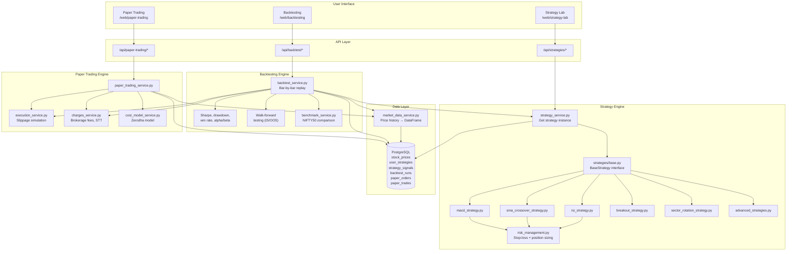

---

## 4. Strategy Framework

### BaseStrategy Interface

All strategies inherit from `BaseStrategy` in `app/strategies/base.py`:

```python
from dataclasses import dataclass
from typing import Optional
import pandas as pd

@dataclass
class SignalResult:
    signal_type: str             # "BUY", "SELL", or "HOLD"
    confidence_score: float      # 0.0 to 100.0
    reason: str                  # Human-readable explanation
    indicators: dict             # {"rsi": 32.4, "stop_loss": 2285.0, "target": 2520.0}

class BaseStrategy:
    name: str                    # e.g., "RSI Strategy"
    description: str
    default_parameters: dict     # e.g., {"period": 14, "oversold": 35}

    def generate_signal(
        self,
        prices: pd.DataFrame,    # OHLCV DataFrame, sorted ascending
        parameters: dict         # User's custom parameters (override defaults)
    ) -> SignalResult:
        raise NotImplementedError
```

### Strategy Registry

`strategy_service.py` maps strategy template names to their implementation classes:

```python
STRATEGY_REGISTRY = {
    "RSI Strategy":             RSIStrategy,
    "SMA Crossover":            SMACrossoverStrategy,
    "MACD Strategy":            MACDStrategy,
    "Breakout Strategy":        BreakoutStrategy,
    "Sector Rotation":          SectorRotationStrategy,
    "VWAP Strategy":            VWAPStrategy,
}

def get_strategy_instance(template_name: str) -> BaseStrategy:
    cls = STRATEGY_REGISTRY[template_name]
    return cls()
```

---

## 5. Implemented Strategies

### RSI Strategy (`rsi_strategy.py`)

**Concept**: RSI (Relative Strength Index) measures momentum. Below 30 = oversold (buy signal), above 70 = overbought (sell signal).

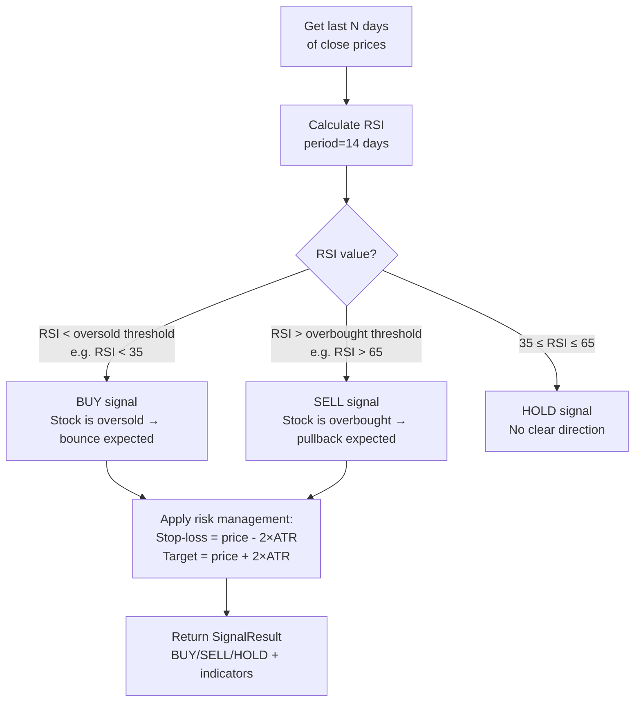

**RSI Formula**:
```
RSI = 100 - (100 / (1 + RS))
RS  = Average Gain over N days / Average Loss over N days

If RSI = 32: stock has been mostly falling → oversold → buy signal
If RSI = 71: stock has been mostly rising → overbought → sell signal
```

**Parameters**:
```json
{
  "period": 14,
  "oversold": 35,
  "overbought": 65,
  "atr_multiplier": 2.0
}
```

---

### SMA Crossover Strategy (`sma_crossover_strategy.py`)

**Concept**: When a fast moving average (20-day) crosses above a slow moving average (50-day), it signals upward momentum.

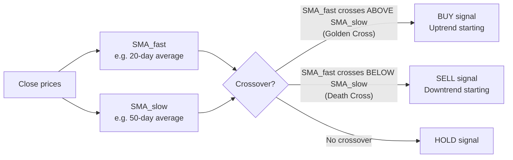

**Parameters**:
```json
{
  "fast_period": 20,
  "slow_period": 50
}
```

---

### MACD Strategy (`macd_strategy.py`)

**Concept**: MACD (Moving Average Convergence Divergence) uses two EMAs and a signal line to detect trend changes.

```
MACD Line    = EMA(12) - EMA(26)
Signal Line  = EMA(9) of MACD Line
Histogram    = MACD Line - Signal Line

BUY:  MACD crosses above Signal Line (histogram turns positive)
SELL: MACD crosses below Signal Line (histogram turns negative)
```

**Parameters**:
```json
{
  "fast_ema": 12,
  "slow_ema": 26,
  "signal_ema": 9
}
```

---

### Breakout Strategy (`breakout_strategy.py`)

**Concept**: When price breaks above a recent high (resistance), it signals a strong upward move.

```mermaid
flowchart TD
    A[Get last N bars] --> B[Calculate rolling\nhigh = max(close, lookback_period)]
    B --> C[Calculate rolling\nlow = min(close, lookback_period)]
    C --> D{Today's close vs. levels}
    D -->|"Close > rolling_high × (1 + breakout_threshold)"| E["BUY signal\nBreakout above resistance"]
    D -->|"Close < rolling_low × (1 - breakout_threshold)"| F["SELL signal\nBreakdown below support"]
    D -->|Inside range| G["HOLD signal"]
```

**Parameters**:
```json
{
  "lookback_period": 20,
  "breakout_threshold_pct": 1.5
}
```

---

### Sector Rotation Strategy (`sector_rotation_strategy.py`)

**Concept**: Rotate capital into the strongest-performing sector each month.

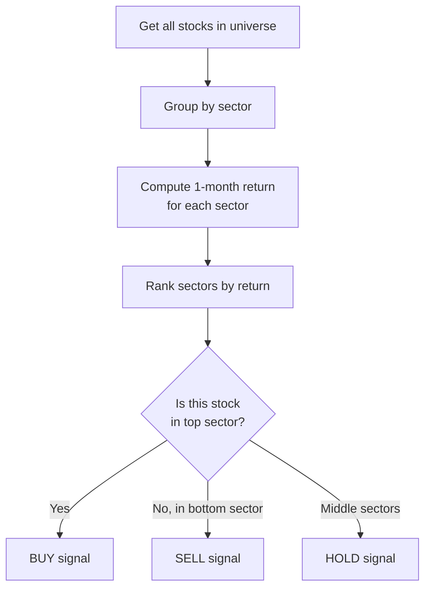

---

## 6. Signal Generation Flow

### How Signals Are Created

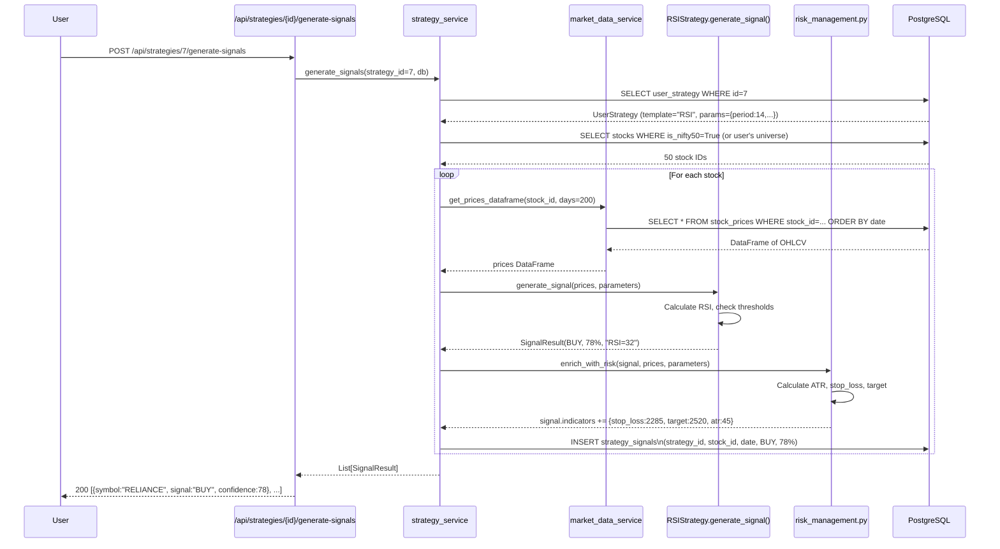

### Signal Outcome Tracking

After a signal is generated, the system tracks whether it was profitable:

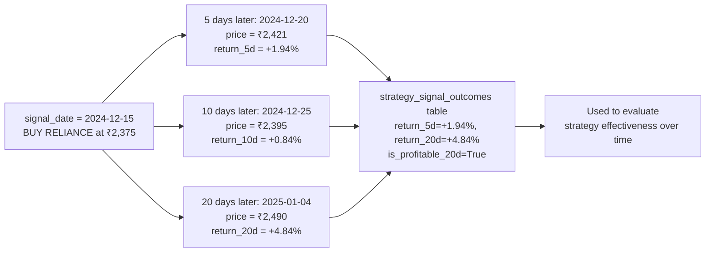

---

## 7. Backtesting Engine

`backtest_service.py` implements a bar-by-bar replay engine.

### The Core Principle: No Lookahead Bias

**Wrong** (lookahead bias — cheating):
```
Day 5: I know the price on Day 10 will be high → BUY on Day 5
```

**Correct** (what backtest_service.py does):
```
Day 5: I only know prices 1..5 → compute signal → maybe BUY
Day 6: Execute the buy at Day 6's open price
Day 10: Decide to sell based on prices 1..10
```

### Backtest Engine Flow

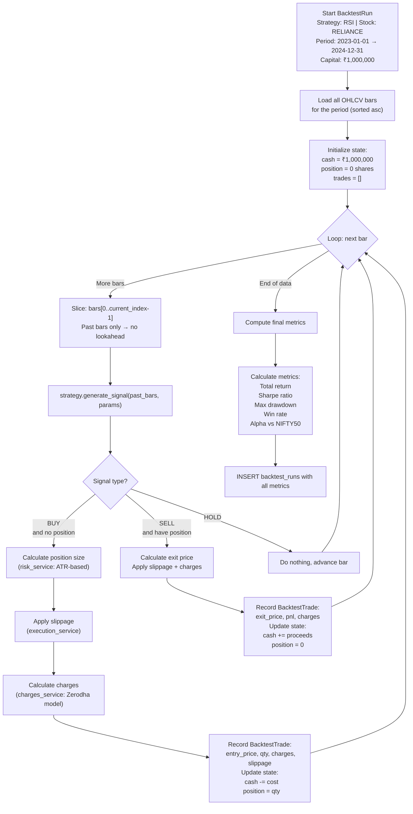

### Execution Modes

The engine supports different timing assumptions:

| Mode | Signal Generated | Trade Executed | Notes |
|------|-----------------|---------------|-------|
| **Default** | At close of Day N | At open of Day N+1 | Most realistic |
| Intraday Conservative | At open of Day N | At close of Day N | Conservative assumption |
| Intraday Optimistic | At open | At high/low | Optimistic assumption |

---

## 8. Paper Trading Engine

Paper trading simulates real-time trading with live prices (from the database).

### Order Types

| Order Type | Execution | Use Case |
|-----------|-----------|---------|
| **MARKET** | Execute immediately at latest price | "Buy now at any price" |
| **LIMIT** | Execute only if price reaches limit | "Buy RELIANCE only if it drops to ₹2,350" |
| **STOP_LOSS** | Sell if price drops to stop level | "Protect a position; sell if RELIANCE falls to ₹2,280" |
| **STOP_LIMIT** | Limit order triggered by stop price | More complex stop-loss |

### Order States

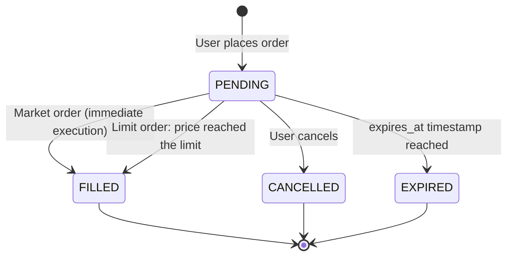

### Market Order Flow

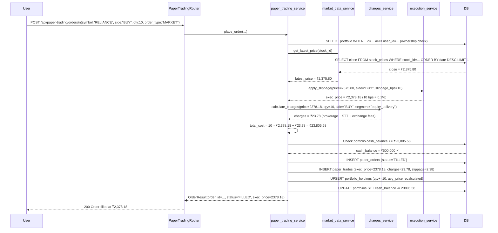

### Limit Order Matching

Limit orders are checked during the next price sync:

```python
# Simplified: runs during market data sync (jobs/)
def match_pending_limit_orders(db: Session):
    pending_orders = db.query(PaperOrder).filter(
        PaperOrder.status == "PENDING",
        PaperOrder.order_type == "LIMIT"
    ).all()

    for order in pending_orders:
        latest_price = get_latest_price(db, order.stock_id)
        
        if order.side == "BUY" and latest_price <= order.limit_price:
            execute_order(db, order, latest_price)  # Execute!
        elif order.side == "SELL" and latest_price >= order.limit_price:
            execute_order(db, order, latest_price)  # Execute!
```

---

## 9. Risk Management

`risk_management.py` adds stop-loss and position sizing to every signal.

### ATR-Based Stop-Loss

```
ATR (Average True Range) = average daily price range over N days

True Range for each day = max(High-Low, |High-PrevClose|, |Low-PrevClose|)
ATR = rolling mean of True Range

Stop-loss = Entry Price - (ATR_multiplier × ATR)

Example:
  Entry = ₹2,375
  ATR   = ₹45
  Multiplier = 2.0
  Stop  = ₹2,375 - (2.0 × 45) = ₹2,285
```

### Position Sizing by Risk Profile

The system adjusts position size based on user's risk profile:

```
Risk per trade = (Portfolio value × risk_pct_per_trade)

Example:
  Portfolio value = ₹500,000
  Risk profile    = "moderate" → risk 1% per trade
  Risk per trade  = ₹5,000
  Stop distance   = ₹2,375 - ₹2,285 = ₹90 per share
  Max shares      = ₹5,000 / ₹90 = 55 shares

Conservative:  0.5% risk per trade
Moderate:      1.0% risk per trade
Aggressive:    2.0% risk per trade
```

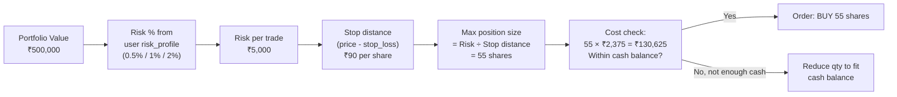

---

## 10. Cost & Charges Model

`charges_service.py` and `cost_model_service.py` implement the Zerodha brokerage fee model (standard Indian broker fees).

### Charges Breakdown

```
For a ₹2,375 × 10 shares = ₹23,750 BUY (equity delivery):

Brokerage:              ₹0           (Zerodha: free for delivery)
STT (Securities Transaction Tax):   ₹23.75  (0.1% of turnover)
Exchange Transaction Charge:         ₹1.78   (NSE: 0.00345%)
SEBI Charges:                        ₹0.17   (₹10 per crore)
GST (18% on brokerage+charges):      ₹0.35
Stamp Duty:                          ₹11.88  (0.015% on buy side)
                                    ------
Total Charges:                       ₹37.93

Net cost = ₹23,750 + ₹37.93 = ₹23,787.93
```

The charges are stored in a JSONB column `charges_breakdown` in `paper_trades` and `backtest_trades`:

```json
{
  "brokerage": 0.0,
  "stt": 23.75,
  "exchange_fee": 1.78,
  "sebi_charges": 0.17,
  "gst": 0.35,
  "stamp_duty": 11.88,
  "total": 37.93
}
```

---

## 11. Performance Metrics

### Key Metrics Computed by backtest_service.py

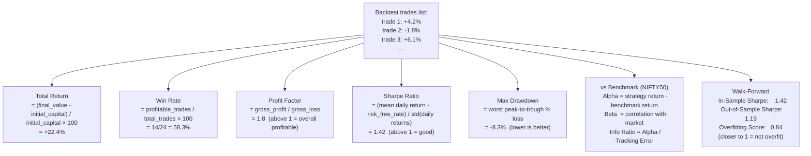

### Sharpe Ratio Interpretation

```
Sharpe < 0:   Strategy loses money vs risk-free rate (very bad)
0 ≤ Sharpe < 1: Some return but not great risk-adjusted
1 ≤ Sharpe < 2: Good strategy
2 ≤ Sharpe < 3: Very good strategy
Sharpe ≥ 3:   Exceptional (rare in practice)
```

---

## 12. Walk-Forward Testing

Walk-forward testing prevents overfitting — where a strategy looks great on historical data but fails in live trading.

### How It Works

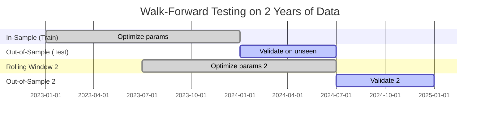

```
in_sample_period:   12 months (optimize parameters here)
out_of_sample_period: 6 months (test WITHOUT changing parameters)

Step 1: Fit strategy parameters on Jan 2023 - Dec 2023 (in-sample)
Step 2: Test those SAME parameters on Jan 2024 - Jun 2024 (out-of-sample)
Step 3: Roll forward: Fit Jul 2023 - Jun 2024, Test Jul 2024 - Dec 2024

Overfitting score = OOS Sharpe / IS Sharpe
  Score > 0.7 → Not overfit (good)
  Score < 0.5 → Possibly overfit (bad, strategy may not work live)
```

### Walk-Forward Database Fields

```sql
-- backtest_runs table has both in-sample and out-of-sample results
SELECT 
  is_sharpe_ratio,          -- In-sample Sharpe (looks good but may be overfit)
  oos_sharpe_ratio,         -- Out-of-sample Sharpe (true measure of robustness)
  overfitting_score,        -- oos/is ratio (want > 0.7)
  walk_forward_windows,     -- How many rolling windows were tested
  in_sample_months,
  out_of_sample_months
FROM backtest_runs WHERE id = 42;
```

---

## 13. Database Schema for Algo

```mermaid
erDiagram
    STRATEGY_TEMPLATES {
        int id PK
        string name UK
        string description
        string strategy_class
        json default_parameters
        bool is_active
        datetime created_at
    }

    USER_STRATEGIES {
        int id PK
        int user_id FK
        int template_id FK
        string name
        json parameters
        json risk_settings
        bool is_active
        string universe
        datetime created_at
    }

    STRATEGY_SIGNALS {
        int id PK
        int strategy_id FK
        int stock_id FK
        date signal_date
        string signal_type
        float confidence_score
        string reason
        json indicators
        datetime created_at
    }

    STRATEGY_SIGNAL_OUTCOMES {
        int id PK
        int signal_id FK
        float return_5d_pct
        float return_10d_pct
        float return_20d_pct
        bool is_profitable_5d
        bool is_profitable_20d
        date outcome_date
    }

    BACKTEST_RUNS {
        int id PK
        int strategy_id FK
        int stock_id FK
        date start_date
        date end_date
        float initial_capital
        float final_value
        float total_return_pct
        float sharpe_ratio
        float max_drawdown_pct
        float win_rate
        float profit_factor
        int total_trades
        float gross_pnl
        float total_charges
        float slippage_cost
        float net_pnl
        float alpha
        float beta
        float tracking_error
        float information_ratio
        string benchmark_code
        float is_sharpe_ratio
        float oos_sharpe_ratio
        float overfitting_score
        int walk_forward_windows
        datetime created_at
    }

    BACKTEST_TRADES {
        int id PK
        int backtest_run_id FK
        int stock_id FK
        string side
        date entry_date
        date exit_date
        float entry_price
        float exit_price
        int quantity
        float gross_pnl
        float charges
        float slippage
        float net_pnl
        float return_pct
        string exit_reason
        json charges_breakdown
    }

    PAPER_ORDERS {
        int id PK
        int portfolio_id FK
        int stock_id FK
        string order_type
        string side
        float quantity
        float limit_price
        float stop_price
        string status
        datetime expires_at
        datetime created_at
    }

    PAPER_TRADES {
        int id PK
        int paper_order_id FK
        float executed_price
        float quantity
        float brokerage
        float stt
        float exchange_fee
        float gst
        float stamp_duty
        float total_charges
        float slippage
        json charges_breakdown
        datetime executed_at
    }

    STRATEGY_TEMPLATES ||--o{ USER_STRATEGIES : "instantiated as"
    USER_STRATEGIES ||--o{ STRATEGY_SIGNALS : "generates"
    USER_STRATEGIES ||--o{ BACKTEST_RUNS : "tested by"
    STRATEGY_SIGNALS ||--o| STRATEGY_SIGNAL_OUTCOMES : "tracked by"
    BACKTEST_RUNS ||--o{ BACKTEST_TRADES : "contains"
    PAPER_ORDERS ||--o{ PAPER_TRADES : "executes"
```

---

## 14. Common Tasks for Interns

### Task: Add a new strategy

1. Create `app/strategies/my_new_strategy.py`:
```python
from app.strategies.base import BaseStrategy, SignalResult
import pandas as pd

class MyNewStrategy(BaseStrategy):
    name = "My New Strategy"
    description = "Strategy description"
    default_parameters = {"period": 14, "threshold": 0.5}

    def generate_signal(self, prices: pd.DataFrame, parameters: dict) -> SignalResult:
        period = parameters.get("period", self.default_parameters["period"])
        # ... your signal logic here ...
        return SignalResult(
            signal_type="BUY",
            confidence_score=75.0,
            reason="My condition met",
            indicators={"my_indicator": 42.0}
        )
```

2. Register in `strategy_service.py`:
```python
STRATEGY_REGISTRY["My New Strategy"] = MyNewStrategy
```

3. Add a seed template in `scripts/seed_strategy_templates.py`

### Task: Debug a backtest giving zero trades

```python
# Check: does the stock have price data in the backtest period?
SELECT COUNT(*), MIN(price_datetime), MAX(price_datetime)
FROM stock_prices
WHERE stock_id = (SELECT id FROM stocks WHERE symbol = 'XYZ')
  AND price_datetime BETWEEN '2023-01-01' AND '2024-12-31';

# Check: what signals did the strategy generate?
SELECT * FROM strategy_signals
WHERE strategy_id = 7
  AND signal_date BETWEEN '2023-01-01' AND '2024-12-31'
ORDER BY signal_date;
```

### Task: Add a new performance metric

1. In `backtest_service.py`, find `calculate_metrics()` function
2. Add your metric calculation after the existing ones
3. Add the column to `BacktestRun` model in `models/backtest.py`
4. Create an Alembic migration to add the column to the DB
5. Add it to the Pydantic response schema in `schemas/backtest.py`

---

## Quick Reference Card

```
Strategy flow:
  User configures strategy parameters in Strategy Lab
  → strategy_service.get_strategy_instance(template_name)
  → BaseStrategy.generate_signal(prices_df, parameters)
  → SignalResult (BUY/SELL/HOLD + confidence + indicators)
  → risk_management.enrich_with_risk(signal, prices)
  → Saved to strategy_signals table

Backtest flow:
  User picks strategy + stock + date range + capital
  → backtest_service.run_backtest()
  → Bar-by-bar replay (no lookahead!)
  → Each bar: generate signal → execute trade → track PnL
  → compute_metrics() → Sharpe, drawdown, win rate, alpha
  → Saved to backtest_runs + backtest_trades tables

Paper trading flow:
  User places MARKET/LIMIT/STOP order
  → market_data_service.get_latest_price()
  → execution_service.apply_slippage()
  → charges_service.calculate_charges() (Zerodha model)
  → Saved to paper_orders + paper_trades tables
  → portfolio_holdings + cash_balance updated

Key strategies:
  RSI:            rsi_strategy.py         → mean reversion
  SMA Crossover:  sma_crossover_strategy  → trend following
  MACD:           macd_strategy.py        → momentum
  Breakout:       breakout_strategy.py    → support/resistance
  Sector Rotation: sector_rotation_strategy → relative strength
  VWAP:           advanced_strategies.py → intraday mean reversion
```
